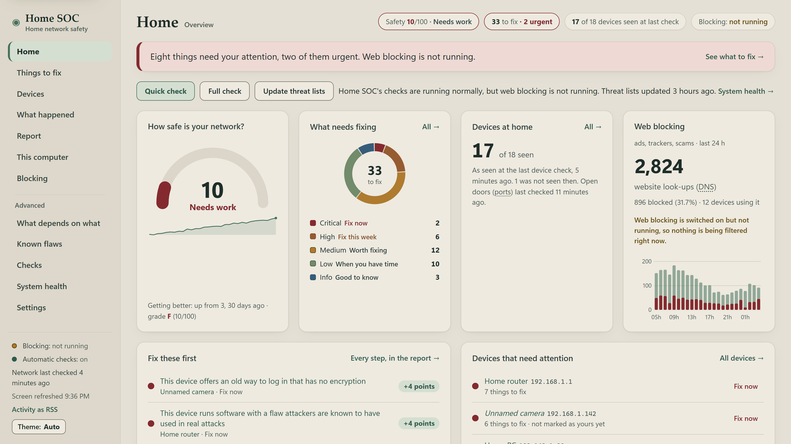
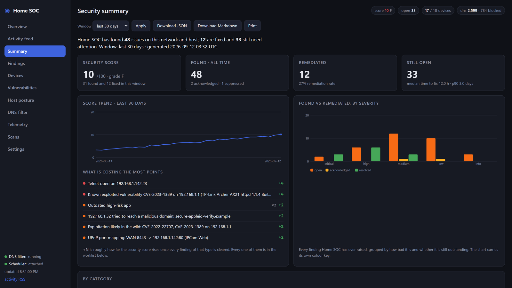
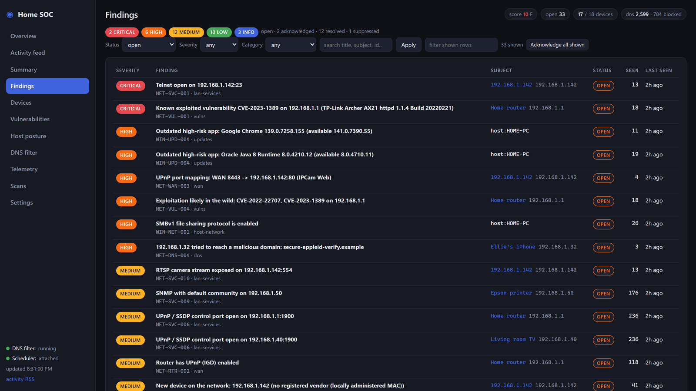
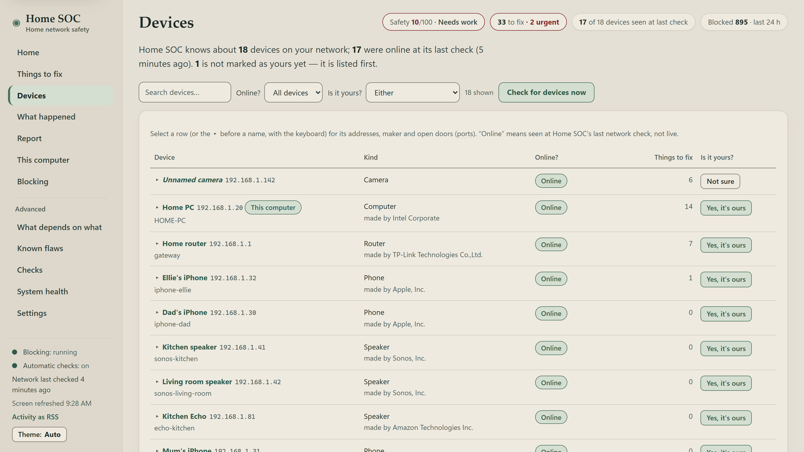
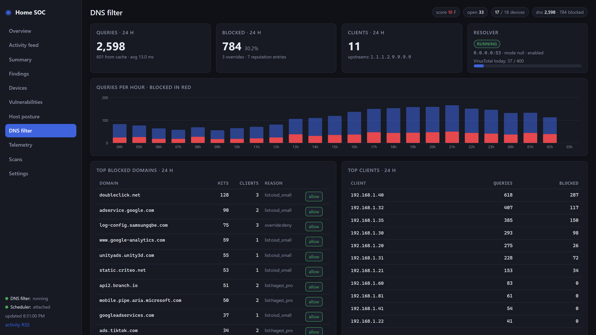

# Home SOC

A small security operations center for your own home network. Home SOC is one Python process you run on a PC you
already own. It keeps threat-intelligence definitions up to date, finds every device on your Wi-Fi, checks what those
devices are listening on, matches what it finds against the CVE catalogues that professionals use, audits the Windows
(or Linux/macOS) machine it runs on, optionally filters DNS for the whole house, and puts all of it on a dashboard at
`http://127.0.0.1:8787` with plain-English steps for fixing what it found. Nothing leaves your machine, there is no
account to create, no cloud, no telemetry, and no admin rights are needed for the default setup.

[](.github/workflows/tests.yml)
[](LICENSE)
[](https://www.python.org/downloads/)



🎬 **[Watch the eight-minute walkthrough video](../../releases)** — the whole tool, end to end. It is published as an asset on the latest release.

> **👉 New here? Start with the [walkthrough](docs/WALKTHROUGH.md).**
> It takes you from download to a dashboard you understand, in order, with the screenshots to match.
> Everything below is reference material you can come back to.

## What it does

- **Updates definitions** — CISA KEV, EPSS exploit-probability scores, the IEEE OUI vendor database and a set of DNS
  blocklists, all with ETag caching so re-checks are nearly free.
- **Scans your network** — finds every device (ARP table first, then a gentle TCP sweep), service-scans them with nmap
  or a built-in Python scanner, and records ports, banners, products and versions.
- **Finds real vulnerabilities** — matches discovered services against CISA KEV, NVD and EPSS, so "exploited in the
  wild" is separated from "theoretically vulnerable".
- **Audits this computer** — Microsoft Defender state, firewall, Windows Update, local accounts, autostart entries,
  listening ports, Wi-Fi encryption and your router's exposure to the internet.
- **Filters DNS for the whole LAN** (optional) — an embedded resolver on port 53 that blocks ads and trackers and
  sinkholes known-malicious domains, with a live query log, per-domain allow/deny overrides and VirusTotal reputation.
- **Shows you a device by pointing a phone at it** (optional) — **Lens**, a phone web app served by Home SOC itself:
  point the camera at a device, and its open ports, CVEs, findings and DNS activity appear over the live image.

Everything it observes lands in one activity feed and one remediation summary, so you can answer both "what happened on
my network?" and "what is still broken?" without knowing where to look.

## What it is not

Home SOC is **not an antivirus engine** and **not an EDR**. It does not hook the kernel, inspect running processes for
malicious behaviour, or scan files with its own detection engine. On Windows it *verifies and complements* Microsoft
Defender: it reads Defender's state (real-time protection, tamper protection, signature age, scan history, the threats
Defender has already quarantined), tells you when something is switched off, and can trigger a Defender quick scan or a
signature update on your behalf. Defender stays the thing that catches malware. Home SOC is the thing that notices
Defender was turned off three weeks ago, that a printer is exposing Telnet, and that your router is running a service
with a known-exploited CVE.

## How it works

```
  ┌──────────────────────────────────────────────────────────────────────────┐
  │  python -m homesoc run  —  one process, one SQLite file, no cloud        │
  └──────────────────────────────────────────────────────────────────────────┘

   definitions               scanners                        findings
   ───────────               ────────                        ────────
   CISA KEV        ┐         discovery  who is here    ┐
   NVD / EPSS      ├───────► services   what listens   ├────►  92 rules
   OUI vendors     │         vulns      known CVEs     │       severity
   DNS blocklists  │         host       this PC        │       score + fix steps
   VirusTotal *    ┘         exposure   your WAN IP    ┘            │
                                                                    │
                                                                    ├──► dashboard
   dnsfilter :53 ──────────► every DNS query from the LAN ──────────┤     :8787
   ads + malware domains     blocked, forwarded, and logged         │
                                                                    └──► alerts
                                                                         ntfy
                                                                         Discord
   * optional, your own key                                              webhook
                                                                         toast
```

## Requirements

- **Python 3.12 or newer.** The launchers check this and tell you if the version is too old.
- **Windows 10/11, Linux or macOS.** Windows gets the deepest host audit (Defender, firewall profiles, Windows Update,
  autostarts); Linux and macOS get a smaller posture check plus the full network side.
- **No administrator / root rights** for the default path: discovery, service scanning, vulnerability matching, the host
  audit and the dashboard all work as a normal user. A few Windows checks (Secure Boot, TPM, BitLocker) simply report
  "needs administrator" instead of failing.
- **nmap is optional.** With it you get product/version/CPE detection, which makes CVE matching much better. Without it,
  Home SOC uses its own connect-and-read-a-banner scanner and raises finding `SOC-SYS-001` to tell you what you are
  missing. Get it from [nmap.org/download.html](https://nmap.org/download.html).
- **Three Python packages**, installed automatically into a local virtualenv: `flask`, `requests`, `dnslib`. Everything
  else is the standard library. No CDN assets, so the dashboard works offline.

## Quick start

### Windows

1. Download or clone this folder somewhere you can write to, e.g. `C:\Users\you\Home_SOC`.
2. **Double-click `run.bat`.**

### Linux / macOS

```sh
cd Home_SOC
chmod +x run.sh    # only if the executable bit did not survive the download
./run.sh
```

### What the first run actually does

Both launchers do exactly the same five things, and each step is checked so a failure ends in one sentence you can act
on rather than a traceback:

1. Creates a virtual environment in `.venv` (a few seconds).
2. Installs `flask`, `requests` and `dnslib` into it (about 15–30 seconds on a normal connection). This is skipped on
   later runs unless `requirements.txt` changed.
3. Runs `python -m homesoc init`: creates `data/`, writes a `config.toml` **with a randomly generated `web.token`**, and
   creates the SQLite schema.
4. Downloads the first two definition feeds — the OUI vendor database (~3 MB) and the CISA KEV catalogue (~1.7 MB),
   a few seconds.
5. Runs `python -m homesoc run`, which starts the scheduler and the dashboard.

**Total: about a minute before the dashboard link appears.** The scans happen in the background after that. On the
author's home network the first pass took roughly: feeds 9 s, device discovery 24 s, WAN exposure 4 s, host posture
30 s, then the service scan of each device (a handful of seconds to ~20 s per device, three devices at a time). Give it
**five minutes** before you judge the dashboard; the first full picture of a 20-device network lands inside that.

Stop it with `Ctrl-C`, or by closing the window.

The very first discovery run is treated as a baseline: every device it finds is filed as `info`, not
as an alarm, so you do not open the dashboard to twenty red "new device" warnings on day one. Once
you have looked over the Devices page and recognise everything on it, accept the whole list in one
go with `python -m homesoc baseline` (add `--dry-run` first to see exactly what it would do). From
then on, only a device that was *not* in that list is reported as new.

### Opening the dashboard

The console prints one line:

```
Dashboard: http://127.0.0.1:8787/login?token=<your-token>  (Ctrl-C to stop)
```

Click that link (or paste it into a browser). The token is exchanged for a cookie, stripped from the address bar and
remembered for 30 days, so from then on plain **<http://127.0.0.1:8787>** is enough. The token lives in `config.toml`
under `[web] token`; set it to `""` if you want no login at all on a single-user machine, and see
[Reaching the dashboard from another device](#the-dashboard-from-my-phone-or-another-pc) before you expose it.

## A tour of the dashboard

| Page | What you see |
|---|---|
| **Overview** (`/`) | The security score and its grade, a **Fix these first** card showing which finding types are costing the most points and how far the score would rise if you cleared each one, open findings broken down by severity, device counts, 24-hour DNS numbers, scheduler job health, when each scan last ran, feed freshness and the latest events. The one page to check daily. |
| **Activity feed** (`/feed`) | One reverse-chronological stream of everything that happened: new and resolved findings, devices joining or going offline, scans finishing, feeds updating, blocked DNS requests, Defender detections, notifications sent. Filter by kind, severity, time window or free text; there is also an RSS version at `/feed.rss`. |
| **Summary** (`/summary`) | The "what was found and what got fixed" report: score trend, found-vs-remediated bars per severity, the remediated table with how long each issue stayed open, and the still-open worklist as expandable cards with numbered remediation steps. Export it as Markdown or JSON, or print it. |
| **Findings** (`/findings`) | Every issue Home SOC has ever raised, filterable by status, severity, category and text. Each row opens into the plain-English explanation, the evidence behind it, the fix steps and reference links; you can acknowledge, resolve or suppress from here. |
| **Devices** (`/devices`) | The inventory: name, IP, MAC, vendor, guessed device kind, online state, when it was first and last seen, how many open ports and findings it has, and whether you have marked it trusted. Click any device for its services, sightings, vulnerabilities and findings, and to rescan just that one. |
| **Map** (`/map`) | What each device depends on, what depends on it, and what stops working when it fails. Click a node for its blast radius: what goes down, what merely loses internet, and what carries on. Every edge is labelled with how it was established — watched, inferred from the network's shape, or only assumed. |
| **Vulnerabilities** (`/vulns`) | Every CVE matched to a real service on a real device, with a KEV badge, CVSS, EPSS probability, which device and service it came from and what the match was based on. Filter to KEV-only or by minimum CVSS to see what genuinely matters first. |
| **Host posture** (`/host`) | This computer's own health: Microsoft Defender status and the threats it handled in the last 30 days, Windows Update state and outdated apps, the grouped posture checks (firewall, accounts, encryption, network), autostart entries and what is listening on the network. Checks that need administrator rights are labelled, not failed. |
| **DNS filter** (`/dns`) | Queries, blocks and clients over 24 hours, a queries-per-hour chart with blocks in red, the top blocked domains and busiest clients, which blocklists are loaded and how big they are, your allow/deny overrides, a live query log and the reputation cache. Empty until you enable the resolver. |
| **Telemetry** (`/telemetry`) | The agent watching itself: metric charts, every scheduled job with its last run, duration, next run and failure count, the scan history and the raw event log. This is where you look when something is not running. |
| **Scans** (`/scans`) | Buttons to run a scan right now — quick, full, host, exposure, feeds, files — plus the history of every scan with status, start time, duration, a summary of what it found and any error. |
| **Settings** (`/settings`) | The config keys that are safe to change while running, grouped by section, saved to the database as overrides on top of `config.toml`. Also a "Test notifications" button, a support-bundle download and a findings/devices/vulns export. |

## Screenshots

*Every screenshot on this page and in `docs/images/` was taken against a fictional demo network, not a real home — the
devices, addresses, findings and DNS queries in them are all made up.*

**Summary** — what was found, what got fixed, and what is still open, with numbered remediation steps.



**Findings** — every issue ever raised, filterable, each one opening into evidence, fix steps and references.



**Devices** — the inventory, with vendor, kind, open ports, findings and online state.



**DNS filter** — queries, blocks and clients over 24 hours, the live query log and your allow/deny overrides.



The remaining pages are in [docs/images/](docs/images/), and the [walkthrough](docs/WALKTHROUGH.md) puts them in order.

## Enabling the LAN-wide DNS ad-blocker and sinkhole

Home SOC ships a DNS resolver that blocks ads and trackers from lists like oisd and HaGeZi, and sinkholes domains that
appear on malware and phishing feeds (URLhaus, ThreatFox, Phishing Army, OpenPhish). Point your router at it once and
every device in the house is covered — including the ones that cannot run an ad-blocker.

The short version:

1. In `config.toml`, set `[dns] enabled = true`. Restart Home SOC.
2. Check it works: `python -m homesoc dns-test googlesyndication.com` should answer with something like
   `policy: block  reason: list:oisd_small`. (Not every ad domain is on every list — `dns-test` always tells you which
   list made the decision, or `reason: default` when nothing matched.)
   The blocklists themselves are downloaded by the first `feeds` job after startup, not by `init`, so until that has run
   once `dns-test` reports `DNS blocklists loaded: 0 lists, 0 entries` and `reason: default` for everything. Force it
   with `python -m homesoc update`.
3. On Windows, allow inbound DNS through the firewall — from an **elevated** PowerShell:
   `powershell -ExecutionPolicy Bypass -File scripts\enable-lan-dns.ps1`
4. In your router's DHCP settings, set the DNS server handed out to clients to this PC's LAN IP. Renew the lease (or
   reboot) on a device and watch the query log fill up on the DNS filter page.

Two honest caveats. First, the PC has to be on: if it sleeps, the whole house loses DNS until it wakes or the router
falls back. Second, **many ISP-supplied gateways do not let you change the DHCP DNS server at all** — this is common
on carrier-supplied gateways. The workaround is to set Home SOC as the DNS server on individual
devices instead.

The full walkthrough — router-by-router, per-device fallback, IPv6, what to do when it breaks — is in
[docs/NETWORK_DNS_SETUP.md](docs/NETWORK_DNS_SETUP.md).

## The dependency map — what breaks if this dies?

The **Map** page (`/map`) draws what each device depends on, what depends on it, and what stops working when it fails.
Click a node and the map highlights its blast radius, with a sentence you can act on:

> If Living-room router fails, 5 devices lose their internet connection. They stay on the local network and can still
> reach each other.

The distinction in that sentence is the useful part. **Degraded** means a device keeps running and stays reachable but
loses something — your laptop with the router unplugged is still on the Wi-Fi and still printing, it has just lost the
way out. **Offline** means genuinely unreachable. On a flat home network a gateway failure degrades nearly everything
and offlines almost nothing, which is not what most people expect.

**Home SOC has no packet visibility**, and the map is built around admitting it. It is a program on a PC, not your
router: when the laptop copies a file to the NAS, those packets never come near it. So this is not a live traffic
diagram, every edge is labelled with how it was established — *observed* (a DNS query, an mDNS advertisement, a UPnP
mapping, devices that dropped off together in a real outage), *inferred* (everything reaches the internet through the
gateway), or *assumed* — and **it would rather show fewer links than invent one**. A printer advertising
`_printer._tcp` becomes a provider node marked *no confirmed consumers* rather than sprouting lines to every device
that might plausibly print. When there is an edge, something real is behind it.

The best edges are learned rather than reasoned: when a group of devices disappears and returns together, Home SOC
records an outage, and after the second time it says so in dates (`NET-DEP-002`). "Together" honestly means *in the
same discovery cycle* — ten minutes by default, not seconds — and every screen that shows an outage says so.

Full guide, including the three blind spots and what would lift the map from inference to measurement:
[docs/TOPOLOGY.md](docs/TOPOLOGY.md).

## Lens — point your phone at a device

**Lens** is a phone-sized web app Home SOC serves itself at `/lens`. You point your phone's camera at something in the
house; Lens works out which device on your network it is and draws what Home SOC knows about it over the live camera
image — open ports with a plain-English gloss, matched CVEs, findings with numbered fix steps, and the domains that
device has been talking to. It is the Devices page, except you are standing in front of the thing while you read it.

Identification is by **machine-readable code**, not by what a device looks like. The first time Lens sees a code it does
not know — usually the barcode the manufacturer already printed on the device — it shows a ranked list and you tap once;
from then on that code resolves instantly. Home SOC prints QR stickers for whatever is left (a smart plug behind the
sofa), and a **Pick manually** button always works. There is no OCR and no image recognition.

The short version:

1. `python -m pip install cryptography` — the one optional dependency, needed only to make a certificate.
2. In `config.toml`: `[web] host = "0.0.0.0"`, `port = 8443`, keep the token; `[lens] enabled = true`. Restart.
3. `python -m homesoc lens cert --regenerate`, then run with TLS: `python -m homesoc run --tls`.
4. Elevated PowerShell, once: `powershell -ExecutionPolicy Bypass -File scripts\enable-lens.ps1 -Port 8443`.
5. Open `/lens/pair` on the computer, press **Show a pairing code**, and scan the QR with the phone.

Three honest limits before you spend an evening on it. **Chrome on Android is the target** — scanning needs the
`BarcodeDetector` API, so other browsers (including everything on iOS) fall back to the device picker rather than the
camera. **The certificate is self-signed**, so the phone warns once and you have to compare a fingerprint; there is no
CA to install, and Chrome will not register the offline service worker on an untrusted certificate. And **Lens is off by
default** — turning it on moves the dashboard from loopback to your LAN, which is a real decision, so it is a config
file edit rather than a checkbox. A paired phone is read-only unless you say otherwise, has its own revocable token
rather than the dashboard password, and the sticker QRs encode an opaque random string — never a MAC, IP, hostname or
device name.

All of it, including the Tailscale alternative, the sticker sheet and troubleshooting, is in
[docs/LENS_SETUP.md](docs/LENS_SETUP.md).

## Notifications

Home SOC batches new findings into one message per scan (never fifty toasts at once) and can send a daily digest.
Set `[notify] min_severity` to control the noise floor (`high` by default) and configure any combination of:

| Channel | Key in `config.toml` | How to set it up |
|---|---|---|
| **ntfy** | `notify.ntfy_url` | Pick an unguessable topic name, install the [ntfy](https://ntfy.sh/) app on your phone, subscribe to it, and set the key to `https://ntfy.sh/your-unguessable-topic`. No account needed — but note the topic name *is* the password, so make it long. Home SOC sets a title, a severity-based priority and tags. |
| **Discord** | `notify.discord_webhook` | In your Discord server: Server Settings → Integrations → Webhooks → New Webhook, copy the URL, paste it in. Messages arrive as coloured embeds, one per scan. |
| **Generic webhook** | `notify.webhook_url` | Any URL that accepts a JSON POST. The body is `{"subject", "body", "severity", "findings": [...], "source": "homesoc", "ts"}` — enough to drive Home Assistant, n8n or a script of your own. |
| **Windows toast** | `notify.windows_toast` | `true` by default on Windows, and needs no extra software. Ignored elsewhere. |
| **Daily digest** | `notify.digest_hour` | The local hour (0–23) for a once-a-day summary through the same channels. `-1` disables it. |

Whatever you configure, press **Test notifications** on the Settings page to confirm it works before you rely on it.
Webhook URLs are treated as secrets: they are never echoed back by the API and never written into error messages.

## The VirusTotal API key (optional)

Home SOC works fully without one. If you add a free personal key it gains two things:

- **DNS reputation lookups** — when a device asks for a domain that is not on any blocklist but looks suspicious,
  Home SOC checks it against VirusTotal (and abuse.ch URLhaus) and raises `NET-DNS-004` if it is malicious.
- **New-download checks** — Home SOC already hashes recent files in your Downloads folder with SHA-256; with a key it
  can look those hashes up and tell you whether a download is known malware. Only the *hash* is ever sent. Your files
  are never uploaded.

To enable it, sign in at virustotal.com, copy your personal API key from the menu under your username (see the
[VirusTotal API docs](https://docs.virustotal.com/docs/api-overview)), and put it in `config.toml` as
`[dns] virustotal_api_key = "..."` — or paste it into the Settings page, where it is stored as a secret and never shown
again. The free public tier allows 4 requests per minute; `dns.virustotal_daily_budget` (default 400) keeps Home SOC
comfortably inside the daily allowance, and both rate limits are enforced locally so you cannot burn your quota by
accident. Use **your own** key: it is tied to your account.

## Command reference

Everything the dashboard does is also available from the terminal. Run these from the project folder, either as
`python -m homesoc <command>` inside the venv, or as `homesoc <command>` if you installed the package.

Global options, valid before any command:

| Option | Meaning |
|---|---|
| `-h`, `--help` | Show help and exit. |
| `--version` | Print the version and exit. |
| `--config PATH` | `config.toml` to use (default: `HOMESOC_CONFIG` or `./config.toml`). |
| `--data DIR` | Data directory (default: `HOMESOC_DATA` or `./data`). |
| `--log-level {DEBUG,INFO,WARNING,ERROR}` | Override `general.log_level`. |

| Command | What it does | Options |
|---|---|---|
| `init` | Create the data dir, `config.toml`, the database schema, and fetch the first feeds. | `--no-feeds` — skip the first feed download. |
| `update` | Update definition feeds. | `--feeds a,b` — comma-separated feed names (default: all enabled). `--force` — ignore ETag/age and re-download. |
| `scan` | Run scans now. | `--quick` — discovery + quick service scan + vulns + wifi. `--full` — every step (the default when `--quick` is absent). `--only a,b` — comma-separated steps: `discovery,services,vulns,topology,host,exposure,wifi,files`. |
| `serve` | Dashboard only (jobs run only when you press a button). | `--host H`, `--port P`, `--tls` — serve over HTTPS with the Lens certificate. |
| `dns` | DNS resolver only, in the foreground. | `--port P`. |
| `run` | Dashboard + scheduler + resolver. This is normal mode, and what `run.bat` / `run.sh` call. | `--tls` — serve over HTTPS (see `lens cert`). |
| `status` | Score, finding counts, device counts, last scans, feed table and job table. | — |
| `findings` | List findings as a table. | `--status {open,acknowledged,resolved,suppressed}`, `--severity {critical,high,medium,low,info}`, `--limit N` (default 500). |
| `baseline` | Accept the devices you already own: tick **Trusted** on every known device and close their "new device" findings (`NET-DEV-001`). Re-running it is a no-op. | `--trust-all` — explicit synonym for the default. `--dry-run` — print what would change and write nothing. |
| `export` | Export findings, devices and vulns as JSON. | `--out FILE` (default `report.json`). |
| `report` | The remediation summary: what was found and what is fixed. | `--days N` (default 30), `--format {md,json}` (default `md`), `--out PATH` — write to a file instead of stdout. |
| `feed` | Plain-text activity feed for the terminal. | `--limit N` (default 50), `--kinds a,b`, `--since AGE` — `30m`, `24h`, `7d`, `2w` or an ISO timestamp. |
| `defender` | Windows Defender actions. | `--quick-scan` or `--update` (exactly one is required). |
| `dns-test DOMAIN` | Show the policy decision and the upstream answer for one domain. | — |
| `blast DEVICE` | What stops working if this device fails: the one-sentence headline, what is degraded, what genuinely goes offline, what is unaffected, and the evidence behind it. `DEVICE` is an IP, a MAC, or a nickname/hostname. | — |
| `lens` | Pair a phone with [Lens](#lens--point-your-phone-at-a-device), list or revoke its tokens, manage the HTTPS certificate. | `pair [--host H] [--port P] [--invert]`, `tokens`, `revoke <id> \| --all`, `cert [--regenerate] [--hosts a,b]`. |

A few things worth trying on day one:

```sh
python -m homesoc status                     # is everything running and current?
python -m homesoc findings --severity high   # the short list that actually matters
python -m homesoc report --days 30 --out report.md
python -m homesoc dns-test googlesyndication.com   # allow or block, and which list decided
python -m homesoc blast 192.168.1.1                # what stops working if the router dies
```

## Configuration

`config.toml` is created on first run from `config.example.toml`, which documents every key with its default. Keys you
change in the Settings page are stored in the database and take precedence over the file.

| Section | What it controls |
|---|---|
| `[general]` | Display name, timezone for display (storage is always UTC) and log level. |
| `[web]` | Dashboard bind address and port, the access token and how often pages auto-refresh. |
| `[network]` | Which subnet to scan, the gateway, IPs never to touch, which vendors count as fragile, and the discovery sweep's ports, thread count and timeout. |
| `[scan]` | Whether to use nmap, how many ports, nmap timing, version detection, the gentler profile for fragile devices, per-host timeout, parallelism and whether to scan the router. |
| `[host]` | Whether to run the posture audit, keep an autostart baseline, and hash new files — and which folders to watch. |
| `[vulns]` | KEV matching, NVD enrichment (and an optional NVD API key), EPSS, and the minimum CVSS worth reporting. |
| `[feeds]` | Whether feeds update at all, how often each family refreshes, and the maximum download size. |
| `[dns]` | The resolver: on/off, listen address and port, upstream resolvers and DoH fallback, block mode, cache size, which blocklists to load, query logging and retention, VirusTotal/URLhaus keys and reputation thresholds. |
| `[notify]` | Minimum severity to notify on, the ntfy/Discord/webhook/toast channels and the daily digest hour. |
| `[schedule]` | How often each job runs: discovery, services, host posture, exposure and feeds. |
| `[lens]` | The phone camera viewer: on/off, whether plain HTTP is refused, whether unknown codes can be learned, whether a paired phone may act as well as read, token lifetime and how many phones may be paired. Not editable from the Settings page — see [docs/LENS_SETUP.md](docs/LENS_SETUP.md). |

## Safety and legal

- **Scan only networks you own or administer.** Port-scanning equipment that is not yours is, in many places, illegal —
  and this is a tool for your own house. `network.cidr` is what draws that line; keep it pointed at your own LAN.
- **Nothing is exploited.** Home SOC connects to open ports, reads the banner a service volunteers, and asks nmap for a
  version string. It never sends an exploit, never tries a credential, never attempts a login, and never modifies
  anything on another device. A "vulnerability" here means "the version we saw matches a published CVE", not "we
  proved it".
- **The scanner is deliberately gentle with IoT devices.** Printers, cameras and anything matching
  `network.fragile_vendors` are scanned with a reduced profile: fewer ports, no version probes. Cheap embedded network
  stacks genuinely hang when poked, and a security tool that bricks your printer is not a security tool. Timing is
  never faster than nmap's `T3`, at most three hosts at a time, and anything listed in `network.exclude` is never
  touched at all.
- **Only known devices are scanned**, only inside your configured subnet, and only after discovery has already seen
  them.
- Running a DNS server on port 53 affects everyone on your network. Tell the other people who live there before you
  point the router at it.

## Privacy

Everything stays on the machine you run it on. There is no account, no cloud component, no analytics, no crash
reporting, no phone-home of any kind.

The SQLite database at `data/homesoc.db` holds your device inventory (MAC addresses, IPs, hostnames, vendors), the
services found on each device, matched CVEs, this computer's posture-check results, autostart entries, SHA-256 hashes of
new downloads, the DNS query log if you enabled the resolver (retained for `dns.log_retention_days`, 14 by default),
every finding and its history, and the record of notifications sent. That is a detailed map of your home. Treat the
`data/` folder as sensitive — it is in `.gitignore`, along with `config.toml`, precisely so you cannot accidentally
publish it.

Outbound connections are limited to: the definition feeds listed in `homesoc/feeds/registry.py` — `www.cisa.gov`
(KEV), `epss.empiricalsecurity.com` (EPSS), `www.wireshark.org` (OUI vendor data), `small.oisd.nl` / `big.oisd.nl`,
`raw.githubusercontent.com` (HaGeZi, StevenBlack), `adguardteam.github.io`, `urlhaus.abuse.ch` /
`threatfox.abuse.ch` / `feodotracker.abuse.ch`, `malware-filter.gitlab.io`, `phishing.army`, `openphish.com` and
`www.spamhaus.org`; `services.nvd.nist.gov` for CVE details; `api.ipify.org` and `internetdb.shodan.io` to learn your
public IP and whether anything is exposed on it; your DNS upstreams if the resolver is on (`1.1.1.2` and `9.9.9.9` by
default, with `cloudflare-dns.com` as the DoH fallback); `www.virustotal.com` and `urlhaus-api.abuse.ch` only if you
supplied a key; and whichever notification endpoint you configured yourself. Nothing else, ever. (Several of those
feeds ship disabled — `oisd_big`, `stevenblack` and `adguard_dns` — so a default install never contacts them.)

## Troubleshooting

**"nmap is not installed" (`SOC-SYS-001`).** Home SOC falls back to its own Python scanner, which finds open ports but
not product versions — so CVE matching gets much weaker. Install nmap from
[nmap.org/download.html](https://nmap.org/download.html) and restart. On Windows, if nmap is installed but Npcap is
broken or missing, nmap silently drops to connect-only mode: still useful, just no SYN scan, no OS detection and no ARP
ping. This is expected and Home SOC works fine that way.

**"Home SOC is not running as administrator" (`SOC-SYS-002`).** This is normal and by design — the default path needs no
elevation. A handful of Windows checks (Secure Boot, TPM, BitLocker) cannot run as a standard user; they are reported as
"needs administrator" on the Host posture page and listed under "Not checked" on the Summary, never counted as failures.
Run from an elevated terminal once if you want those answers.

**Port 53 is already in use.** The resolver will not bind and you get `NET-DNS-002` on the dashboard. On Windows the
usual culprits are the Internet Connection Sharing service or a Docker/WSL networking helper; on Linux it is almost
always `systemd-resolved`. Either stop the other listener, or run Home SOC's resolver on a different port with
`[dns] port = 5300` (any free port — avoid 5353 and 5355, which mDNS and LLMNR already use) — but note that clients and
routers can only be pointed at port 53, so a non-standard port is for testing. Home SOC retries binding every five
minutes on its own, so fixing the conflict is enough — you do not have to restart it.

**The PC went to sleep.** Home SOC only scans while the process is running. If the machine sleeps, scans stop and — if
you enabled it — LAN DNS stops with them, which usually looks like "the internet broke". Either set the power plan to
never sleep while plugged in, or run Home SOC on something that stays awake. `scripts/make-autostart.ps1` creates a
Startup-folder shortcut (no admin needed) so it comes back at every logon.

<a id="the-dashboard-from-my-phone-or-another-pc"></a>
**Reaching the dashboard from another device.** By default the dashboard listens on `127.0.0.1` and is reachable only
from the machine it runs on. To reach it from your phone, set `[web] host = "0.0.0.0"`, **keep a non-empty
`[web] token`** (Home SOC raises `SOC-SYS-003` if you don't), allow the port through your firewall, and browse to
`http://<that-pc-lan-ip>:8787/login?token=<your-token>`. It is plain HTTP on your LAN, so do not do this on a network
you share with strangers.

**Nothing appears on a page.** Check the Telemetry page: it shows every job's last run, duration and failure count, plus
the raw event log. `python -m homesoc status` prints the same thing in the terminal. Launcher-level failures (wrong
Python, no network on the first install) are appended to `data/logs/launcher.log`; everything after startup goes to
`data/logs/homesoc.log`.

## Project layout

```
Home_SOC/
  run.bat  run.sh              launchers: venv, deps, init, run
  config.example.toml          every setting, with its default and a comment
  pyproject.toml  requirements.txt
  homesoc/
    cli.py                     the commands above, the scheduler's job list, the runtime
    config.py  db.py  models.py  paths.py  scheduler.py  util.py
    feeds/                     the feed registry, downloader (ETag-aware) and parsers
    scanners/                  discovery, ports, services, host posture, Defender,
                               updates, persistence, exposure, files, ps/*.ps1
    vulns/                     CPE handling, KEV/NVD/EPSS matching and enrichment
    findings/                  the 92-rule catalog, the lifecycle engine and the score
    notify/                    ntfy, Discord, webhook and Windows toast
    dnsfilter/                 the resolver: policy, upstreams, cache, reputation, query log
    topology/                  the dependency graph, outage learning and blast radius
    web/                       Flask app, JSON API, feed and summary builders, templates, static,
                               and Lens: lens.py, tls.py, qr.py (a dependency-free QR encoder)
  scripts/                     install.ps1  install.sh  enable-lan-dns.ps1  enable-lens.ps1
                               make-autostart.ps1
  tests/                       the offline test suite
  docs/                        the documents listed below
  data/                        runtime only, gitignored: homesoc.db, feeds/, logs/
```

Running the tests:

```sh
python -m pytest -q
```

They are offline and fixture-driven; tests that would touch the real network are skipped unless you ask for them.

## Documentation

- [docs/WALKTHROUGH.md](docs/WALKTHROUGH.md) — **start here.** Download to a dashboard you understand, in order, with
  screenshots.
- [docs/GUIDE_HOME_PROTECTION.md](docs/GUIDE_HOME_PROTECTION.md) — how to actually secure a home network, whether or not
  you use this tool.
- [docs/NETWORK_DNS_SETUP.md](docs/NETWORK_DNS_SETUP.md) — the full LAN DNS walkthrough, router by router.
- [docs/LENS_SETUP.md](docs/LENS_SETUP.md) — Lens: certificates, pairing a phone, stickers, and the honest limits.
- [docs/TOPOLOGY.md](docs/TOPOLOGY.md) — the dependency map: where every edge comes from, how blast radius is worked
  out, what Home SOC structurally cannot see, and what would make the map dramatically better.
- [docs/PLAYBOOKS.md](docs/PLAYBOOKS.md) — what to do about each kind of finding.
- [docs/ARCHITECTURE.md](docs/ARCHITECTURE.md) — how the pieces fit together, for anyone reading the code.
- [docs/SPEC.md](docs/SPEC.md) and [docs/SPEC_ADDENDUM.md](docs/SPEC_ADDENDUM.md) — the build contract this was written
  against.
- [docs/RESEARCH.md](docs/RESEARCH.md) — the sources, feeds and measurements behind the design decisions.
- [docs/TESTED_ENVIRONMENT.md](docs/TESTED_ENVIRONMENT.md) — the environment this was built and measured against, so you
  know which numbers came from a real machine.
- [CHANGELOG.md](CHANGELOG.md) — what changed in each release.

## Contributing and security

Bug reports, new finding rules and platform fixes are all welcome — see [CONTRIBUTING.md](CONTRIBUTING.md) for how to set
up a dev environment and what a good pull request looks like. If you find a security problem *in Home SOC itself*,
please read [SECURITY.md](SECURITY.md) and report it privately rather than opening a public issue.

## License

MIT — see [LICENSE](LICENSE). The threat-intelligence feeds Home SOC downloads carry their own licences, recorded next
to each entry in `homesoc/feeds/registry.py`; a few (Phishing Army, OpenPhish, EPSS, Spamhaus DROP) are free for
non-commercial use only, so check them before you build something commercial on top.
