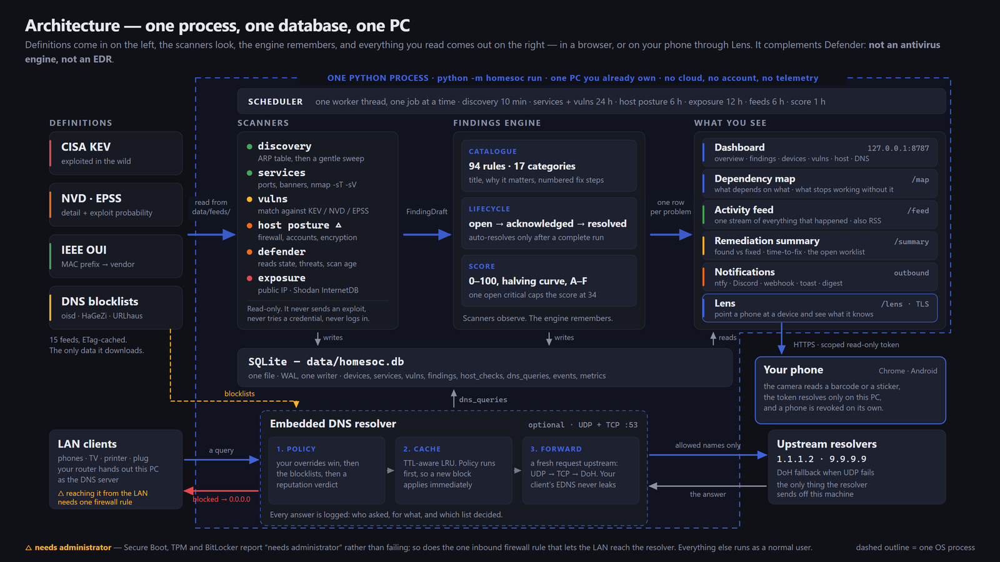
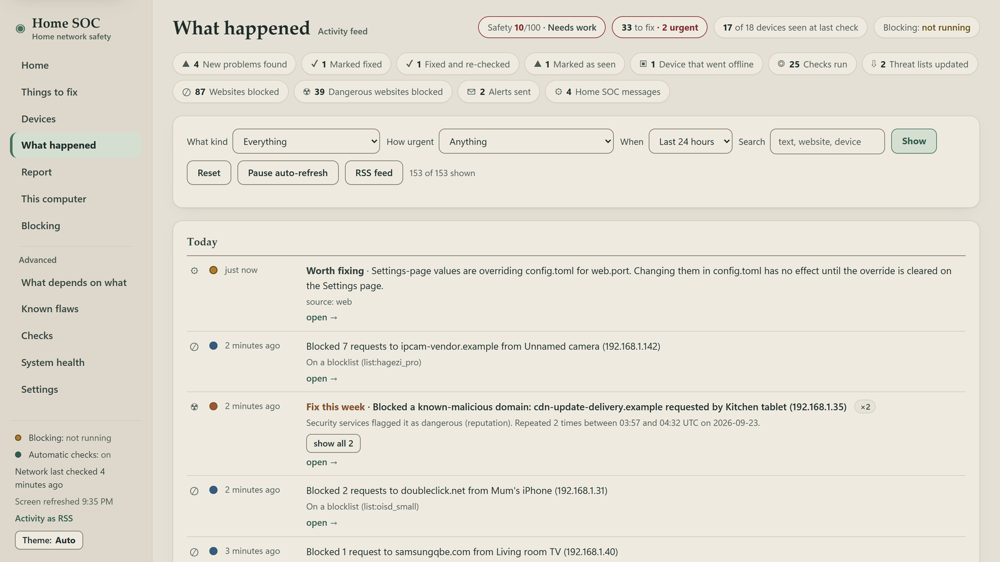
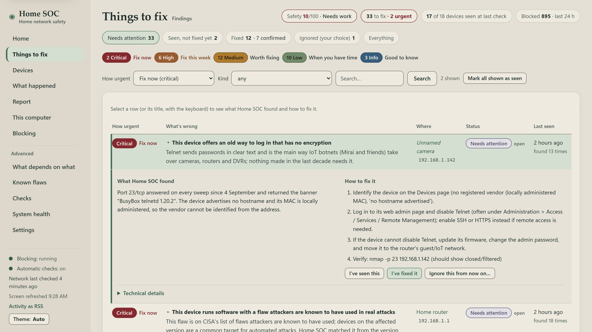
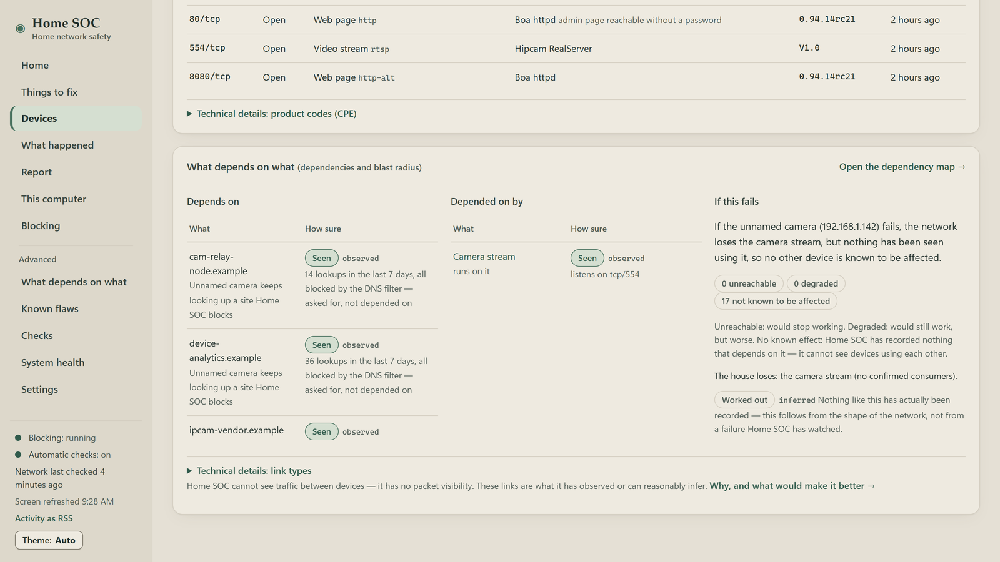
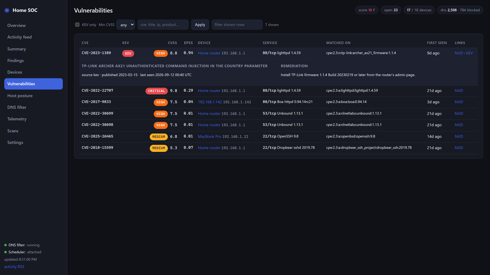
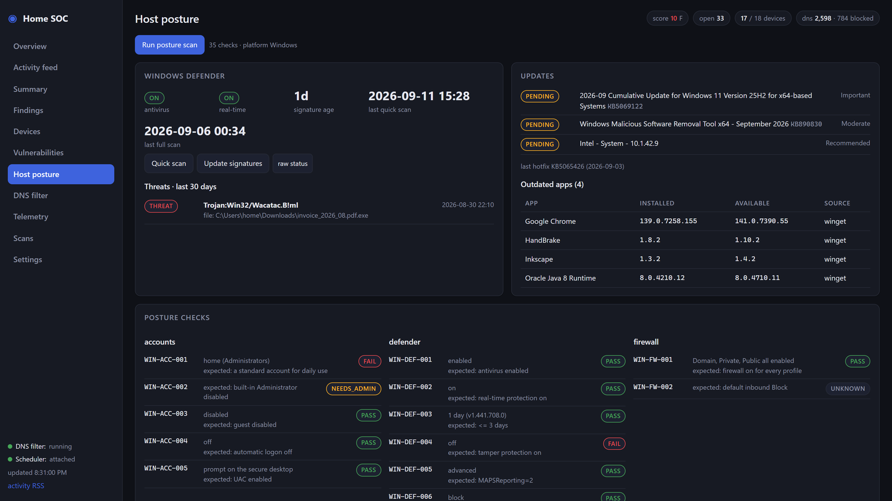
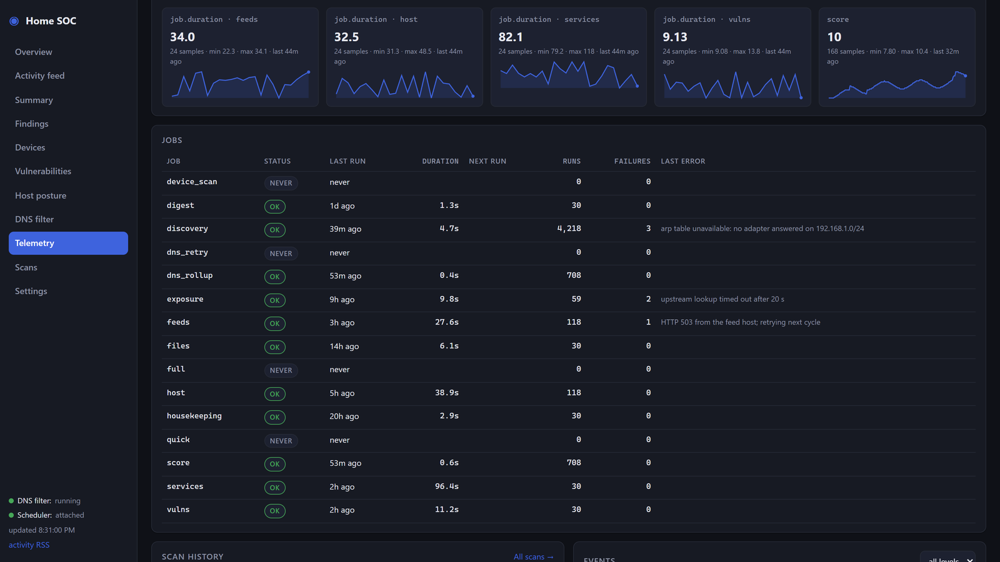
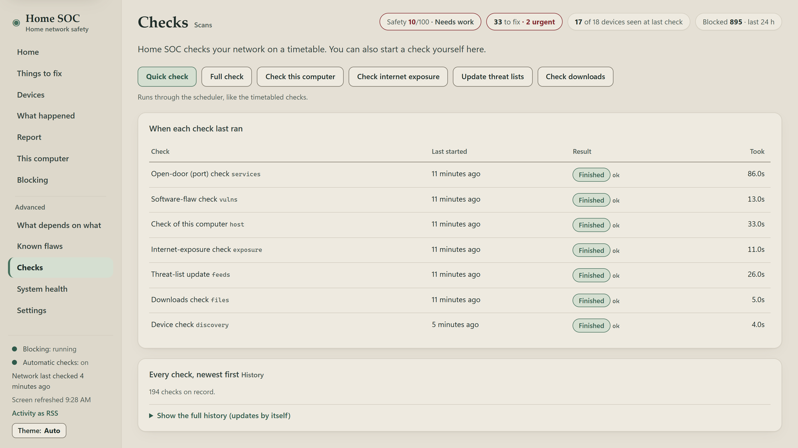

# Home SOC — a walkthrough

This is the long-form tour. It assumes you have never heard of Home SOC and it tries to leave you
knowing four things: what the program is, how it works inside, how to run it, and what every page of
its dashboard is for.

Nothing here is aspirational. Every command below was run and its output pasted in; every screenshot
is of the real dashboard.

> **About the screenshots.** They all show a *fictional* demo network — a made-up family home with
> eighteen invented devices — generated by `video/seed_demo.py` into its own database. It is not
> anybody's real house. The demo host is called `HOME-PC`, the Wi-Fi is `Home-WiFi`, the public
> address is `203.0.113.42` (a documentation address from RFC 5737) and the MAC addresses are
> invented. The terminal output further down comes from the same demo database, which is why the
> command lines carry `--data video/demo_data`.

---

## Contents

1. [What Home SOC is, and what it is not](#1-what-home-soc-is-and-what-it-is-not)
2. [The 60-second version](#2-the-60-second-version)
3. [Watch it instead](#3-watch-it-instead)
4. [How it works](#4-how-it-works)
5. [A guided tour of the dashboard](#5-a-guided-tour-of-the-dashboard)
6. [Turning on the network-wide DNS filter](#6-turning-on-the-network-wide-dns-filter)
7. [Living with it](#7-living-with-it)
8. [Safety, legality and privacy](#8-safety-legality-and-privacy)
9. [Where to go next](#9-where-to-go-next)

---

## 1. What Home SOC is, and what it is not

A home network used to be a laptop and a printer. Now it is a laptop, three phones, a television, two
speakers, a doorbell, a couple of smart plugs and — very often — one device nobody in the house can
quite account for. Every one of those has firmware, most have a web interface, several have ports
open, and none of them tell you when something is wrong.

Home SOC is one Python process you run on a PC you already own. It keeps threat-intelligence
definitions up to date, finds every device on your network, checks what those devices are listening
on, matches what it finds against the same CVE catalogues professionals use, audits the computer it
runs on, optionally filters DNS for the whole house, and puts all of it on a dashboard at
`http://127.0.0.1:8787` with plain-English steps for fixing what it found.

There is no account, no cloud, no telemetry, and the default setup needs no administrator rights.

### What it is not

**Home SOC is not an antivirus engine and not an EDR.** It does not hook the kernel, watch running
processes for malicious behaviour, or scan files with a detection engine of its own. It has no
signatures. It cannot stop a program from running.

On Windows it *verifies and complements* Microsoft Defender. It reads Defender's state — real-time
protection, tamper protection, signature age, scan history, the threats Defender has already
quarantined — tells you when something is switched off, and can trigger a Defender quick scan or a
signature update on your behalf. Defender stays the thing that catches malware. Home SOC is the thing
that notices Defender was turned off three weeks ago, that a printer is exposing Telnet, and that
your router is running a service with a known-exploited CVE.

It is also not an IDS (it never sees your traffic), not an offensive scanner (it never sends an
exploit, never tries a credential, never attempts a login), not a router replacement (it tells you
what to click; it cannot click it), and not real-time (the unit of work is a scheduled scan measured
in minutes and hours). The full list of non-goals is in
[ARCHITECTURE.md §10](ARCHITECTURE.md#10-non-goals).

### Who it is for

- Someone who runs a household network and would like to know what is on it, without becoming a
  network engineer to find out.
- Someone who already has Defender or an equivalent and wants a second, independent opinion about
  whether it is actually switched on.
- Someone with IoT devices they do not trust and no easy way to see what those devices expose.
- Someone who wants network-wide ad and malware-domain blocking without buying an appliance.
- Anyone learning security who would like a real, honest tool to read: it is about 32,000 lines of
  Python with 719 tests, MIT-licensed, no dependencies beyond `flask`, `requests` and `dnslib`.

It is *not* for scanning a network you do not own or administer. See
[section 8](#8-safety-legality-and-privacy).

---

## 2. The 60-second version

### Requirements

- **Python 3.12 or newer.** The launchers check this and say so if the version is too old.
- **Windows 10/11, Linux or macOS.** Windows gets the deepest host audit (Defender, firewall
  profiles, Windows Update, autostarts); Linux and macOS get a smaller posture check plus the full
  network side.
- **No administrator / root rights** for the default path. A few Windows checks (Secure Boot, TPM,
  BitLocker) report "needs administrator" rather than failing.
- **nmap is optional** but recommended: with it you get product/version/CPE detection, which makes
  CVE matching considerably better. Without it, Home SOC uses its own connect-and-read-a-banner
  scanner and raises finding `SOC-SYS-001` to tell you what you are missing.

### Install and first run

**Windows** — download or clone the folder somewhere you can write to, then:

```
run.bat
```

(Double-clicking it does the same thing.)

**Linux / macOS**:

```sh
cd Home_SOC
chmod +x run.sh    # only if the executable bit did not survive the download
./run.sh
```

### What the first run actually does

Both launchers do exactly the same five things, and each step is checked, so a failure ends in one
sentence you can act on rather than a traceback.

| Step | What happens | How long |
|---|---|---|
| 1 | Creates a virtual environment in `.venv` | a few seconds |
| 2 | Installs `flask`, `requests` and `dnslib` into it (skipped on later runs unless `requirements.txt` changed) | 15–30 s on a normal connection |
| 3 | `python -m homesoc init` — creates `data/`, writes `config.toml` **with a randomly generated `web.token`**, creates the SQLite schema | under a second |
| 4 | Downloads the first two definition feeds: the OUI vendor database (~3 MB) and the CISA KEV catalogue (~1.7 MB) | a few seconds |
| 5 | `python -m homesoc run` — starts the scheduler and the dashboard | immediate |

**Total: about a minute before the dashboard link appears.** The scans then happen in the background.
On the development machine the first pass took roughly: feeds 9 s, device discovery 24 s, WAN
exposure 4 s, host posture 30 s, then a service scan of each device (a handful of seconds to about
20 s per device, three devices at a time).

Give it **five minutes** before you judge the dashboard. The first full picture of a twenty-device
network lands inside that.

Stop it with `Ctrl-C`, or by closing the window.

### Opening the dashboard

The console prints one line:

```
Dashboard: http://127.0.0.1:8787/login?token=<your-token>  (Ctrl-C to stop)
```

Click it. The token is exchanged for a cookie, stripped from the address bar and remembered for 7
days (renewed while you use it), so from then on plain <http://127.0.0.1:8787> is enough. The token lives in `config.toml` under
`[web] token`. If you later let other devices reach the dashboard, Home SOC insists on a real token:
with `[web] token` empty it makes one, saves it and prints the sign-in link, and a token shorter than
16 characters makes it refuse to start.

### The one thing to do on day one

The very first discovery run is treated as a baseline: every device it finds is filed as `info`, not
as an alarm, so you do not open the dashboard to twenty red "new device" warnings. Look over the
Devices page, and once you recognise everything on it, accept the whole list in one go:

```sh
python -m homesoc baseline --dry-run   # see exactly what it would do
python -m homesoc baseline             # apply it
```

From then on, only a device that was *not* in that list is reported as new. Real output from both is
in [section 7](#7-living-with-it).

---

## 3. Watch it instead

If you would rather see it than read it, there is a walkthrough video made for people who are not
technical. *Meet the Household: one week with Home SOC* follows a family who guess they have seven
gadgets on the Wi-Fi, find out it is eighteen (one of them a camera nobody remembers buying), and sort
things out one fix a day. Each technical idea this guide covers — open ports, Telnet, flaws attackers
are actively using, updates, DNS blocking, what depends on what, Lens — gets an everyday analogy, and
there are jokes along the way.

[](../../../releases/latest)

**[Watch the walkthrough](../../../releases/latest)** — 9 minutes, narrated, with subtitles included. The MP4 and its subtitle track are assets on the latest release.

The video was recorded against the same fictional demo network as the screenshots below, with web
blocking genuinely running. The first release's more technical tour of the earlier design is still
attached to [v0.1.0](../../../releases/tag/v0.1.0).

---

## 4. How it works



*One process, one SQLite file, no cloud. Definitions come in from the left; scanners observe; the
findings engine decides what is a problem and what has stopped being one; everything lands in one
database that the dashboard, the CLI and the notifiers read.*

`python -m homesoc run` is a single OS process. Nothing is containerised, there is no message broker,
no background service, no separate worker. Inside it:

- the **main thread** runs the Flask dashboard, bound to `127.0.0.1:8787` by default;
- a **scheduler thread** (`homesoc-scheduler`) runs jobs *one at a time*;
- when the DNS filter is enabled, **`dns-udp` and `dns-tcp` listeners** plus three small helper
  threads (housekeeping, query-log batching, reputation lookups);
- one shared `sqlite3.Connection` underneath all of it.

Only two ports are ever opened: TCP 8787 for the dashboard and UDP+TCP 53 for the resolver. Everything
else — feed downloads, NVD lookups, port scans, DNS forwarding — is an outbound connection.

Jobs run one at a time deliberately. A discovery sweep, a service scan and a 4 MB blocklist download
all hitting the Wi-Fi at the same moment is exactly what makes a printer or a smart plug fall over.
SQLite also prefers one writer.

### Definitions in

`homesoc/feeds/registry.py` is the single source of truth: fifteen entries, each with a URL, a kind
(`kev`, `epss`, `oui`, `hosts`, `domains`, `adblock`, `ip`, `json`), a parser, a refresh cadence and a
licence note.

- **CISA KEV** — the catalogue of vulnerabilities *known to be exploited in the wild*.
- **EPSS** — a probability, per CVE, of exploitation in the next thirty days.
- **The IEEE OUI database** — which vendor owns which MAC address prefix.
- **DNS blocklists** — oisd, HaGeZi and friends for ads and trackers; URLhaus, ThreatFox, Phishing
  Army, OpenPhish and Spamhaus for malware and phishing domains.

Downloads are ETag-aware, so a re-check that finds nothing new costs one HTTP round trip. Each fetch
streams to a temporary file with a size cap, a wall-clock cap and a throughput floor, then lands with
an atomic rename — a crash can never leave a truncated blocklist in place. A failure leaves the
previous file exactly where it was, so a flaky mirror degrades to "stale", never to "empty". Feeds
that have had no successful fetch for 48 hours raise a finding of their own.

### Scanners

Scanners observe and write the tables they own. They are stateless: they re-emit the same observation
every run and never decide a finding's life story.

| Scanner | What it does |
|---|---|
| **discovery** | Reads the OS neighbour (ARP) table, runs a gentle TCP-connect sweep of the subnet to populate it, reads it again. ARP-first is why it works without nmap and without administrator rights. |
| **services** | Port and version scan of online devices, via nmap when available (`-sT -sV --version-light -T3 --top-ports N`, never faster than T3, at most three hosts at a time) or Home SOC's own Python scanner otherwise. |
| **vulns** | Matches discovered products and versions against KEV, NVD and EPSS. |
| **host** | This computer: Defender, firewall, Windows Update, local accounts, autostart entries, listening ports, Wi-Fi encryption. |
| **exposure** | Your public IP, what Shodan's InternetDB says is visible on it, and UPnP port mappings your router has opened. |
| **files** | SHA-256 hashes of new files in the watched download folders, looked up if you supplied a VirusTotal key. |

Devices whose vendor matches `network.fragile_vendors` (printers, cameras, speakers) get a reduced
profile: fewer ports, no version probes. Cheap embedded network stacks genuinely hang when poked, and
a security tool that bricks your printer is not a security tool.

### The findings engine

A scanner emits a **draft**: a finding ID plus an evidence dictionary. The catalog
(`homesoc/findings/catalog.py`) owns everything a human reads — 88 finding IDs across 16 categories,
each with a title template, an explanation of why it matters, numbered remediation steps and
reference links. The engine (`homesoc/findings/engine.py`) owns the memory.

A finding's identity is its **dedupe key**: `finding_id | subject`, plus an evidence key when one
subject can carry several instances of the same problem. Subjects look like `host`, `device:<mac>`,
`device:<mac>:443`, `wan`, `wifi`, `dns`, `dns:<client>`, `feed:<name>`, `job:<name>`.

**The lifecycle:**

- **No row exists** → insert it as `open`, write an `opened` event.
- **A row exists and is open or acknowledged** → refresh `last_seen`, increment `occurrences`,
  refresh the evidence, title and severity.
- **A row exists and is suppressed** → same refresh, still suppressed. *A rescan never undoes a
  decision you made.*
- **A row exists and was resolved** → status goes back to `open`, `resolved_at` is cleared, a
  `reopened` event is written. (If it had been auto-resolved from an acknowledged row, it comes back
  acknowledged, not open.)

And the other direction — **auto-resolve**, "it went away". After a run, any open or acknowledged
finding from the same source, whose subject is inside the scope that was scanned, but which was *not*
reported this time, is marked resolved with an `auto_resolved` event.

The guard that makes this safe is `cli.effective_scope()`: **only a complete, successful run may
auto-resolve anything.** If the scanner errored, if the summary is flagged partial, or if it scanned
zero targets, the scope is empty and nothing is resolved. "We did not look" is never mistaken for
"the problem is gone".

### The security score, honestly

The score is one number between 0 and 100, with a letter grade. It works like this:

1. Each unfixed finding is a *slot* worth `weight × status factor`. Weights: critical 30, high 12,
   medium 5, low 1.5, info 0. Status factor: 1.0 when open, 0.25 when acknowledged. Resolved and
   suppressed rows are worth nothing.
2. Within one finding ID the slots are sorted worst-first and each successive one is discounted by
   half, capped at twice the first. Twenty-six "outdated app" rows cost about 3 penalty points, not
   39.
3. `score = 100 × 0.5 ** (penalty / 60)`. It is a halving curve, not a subtraction. An earlier
   subtractive version pinned every real home to 0, where it stayed no matter what the user fixed.
4. **Ceilings override the arithmetic.** One open critical caps the score at **34**. Two or more cap
   it at **20**. Any open high caps it at **79**.

That last rule is the important one and it is deliberately blunt: **an A means "nothing high or
critical is open"**, and no amount of tidying up low-severity findings will buy you one while a
critical is outstanding. The demo network in the screenshots below scores 10 out of 100 (grade F);
with two open criticals, nothing it fixed elsewhere could have lifted it above 20. Grades are
A ≥ 80, B ≥ 65, C ≥ 50, D ≥ 35, F below.

The score is recorded hourly into the `metrics` table, which is where the trend line comes from.

### SQLite

One file, `data/homesoc.db`, in WAL mode, shared by every thread. All timestamps are UTC ISO-8601
strings; display-time zone conversion happens in the browser. Writes go through a module-level lock;
reads are lock-free.

Housekeeping runs daily: metrics, notifications and scans are purged after 90 days, events and device
sightings after 30 (always keeping each device's newest sighting), and the WAL is checkpointed back to
the OS. The DNS query log is purged separately on its own retention setting (14 days by default),
*after* the hourly rollup has been written, so the charts keep their history even when the raw rows
are gone.

### The dashboard

Server-rendered Jinja templates over a small JSON API. **There are no external assets at all** — no
CDN, no web font, no image file. Everything the browser loads comes from `homesoc/web/static/`,
including the charts, which are hand-drawn SVG. The dashboard works with the machine offline.

The web layer reads the tables with its own SQL rather than importing the scanner packages, so the
dashboard renders even when a scanner has never run, is missing, or is mid-edit.

**Plain words beside the technical ones.** Every page leads with plain language — "Things to fix",
"Fix now", "Needs attention", "Unnamed camera (192.168.1.142)" — and keeps the technical name beside
it or one click away under **Technical details**. Nothing technical was removed. Two honesty rules
shape the wording: the dependency map never claims to show connections or traffic, and EPSS is
always "the chance this flaw is exploited somewhere in the next 30 days", never a chance that your
home is attacked. When the last network check is older than three times its schedule, every page
says so at the top.

**Themes.** The dashboard is designed to be left up on a screen. **Day** ("Stone & Sage", the
default) is warm stone and paper with deep slate-green text; **Dusk** is the same room after sunset,
in warm cocoa rather than black and neon; **Auto** follows the computer's light/dark setting. The
**Theme** button at the foot of the sidebar switches between them, and the choice is remembered in
that browser. A healthy screen carries no alarm colour at all, and colour is never the only signal.

### The embedded DNS resolver

Optional, off by default. When enabled, it listens on UDP and TCP port 53 and every DNS query from
your LAN goes through this pipeline:

1. **Is the source private?** Queries from public addresses are dropped without an answer — it can
   never become an open reflector.
2. **Rate limits** — 300 queries/second per client, 3000 globally.
3. **Parse and sanity-check** the request.
4. **Policy decision.** The name's suffixes are walked most-specific-first
   (`a.b.example.com` → `b.example.com` → `example.com` → `com`) and at each step: your *allow*
   overrides win over everything; then your *deny* overrides; then never-block suffixes (`localhost`,
   `lan`, `home.arpa`, …); then the loaded blocklists; then reputation verdicts; otherwise allow.
5. **Cache** — a TTL-aware LRU, TTLs clamped between 30 s and 1 h.
6. **Forward upstream** — a *fresh* request is built with a new ID and minimal EDNS, so the client's
   EDNS options never leak upstream, plus 0x20 case randomisation. UDP first, TCP on truncation,
   then DNS-over-HTTPS as a last resort if configured.
7. **Log** the query, and enqueue newly seen domains for a reputation lookup.

Policy runs **before** the cache on purpose: a name that was allowed and cached an hour ago must be
blocked the moment a list update or a reputation verdict says otherwise.

### The scheduler

Every job on a timer also runs once at startup, except the DNS re-bind retry and the daily digest.

| Job | Default interval | What it does |
|---|---|---|
| `feeds` | 6 h | update every enabled feed |
| `discovery` | 10 min | ARP table + TCP sweep of the LAN |
| `services` | 24 h | port/version scan of online devices |
| `vulns` | 24 h | match services against KEV / NVD / EPSS |
| `host` | 6 h | posture, Defender, updates, persistence, Wi-Fi |
| `exposure` | 12 h | public IP, InternetDB, UPnP mappings |
| `files` | 24 h | hash new downloads |
| `dns_rollup` | 1 h | hourly rollup and retention purge |
| `score` | 1 h | record the score metric |
| `housekeeping` | 24 h | purge old telemetry, checkpoint the WAL |
| `dns_retry` | 5 min | re-bind the resolver if port 53 was busy at startup |
| `digest` | daily | one summary notification |
| `quick`, `full`, `device_scan` | manual only | the dashboard's Run buttons |

A job that raises is caught, recorded as an error, and the scheduler carries on. Three consecutive
failures raise a finding (`SOC-SYS-004`) so a quietly broken job cannot hide.

---

## 5. A guided tour of the dashboard

Ten pages plus Settings. Each exists to answer one question. The sidebar groups them: the everyday
pages first (Home, Things to fix, Devices, What happened, Report, This computer, Web blocking),
then an **Advanced** group (What depends on what, Known flaws, Checks, System health, Settings).
Each heading below gives the page's plain name, then its technical name in brackets — the name it
had before, which still sits beside the page title. The addresses are unchanged.

### Home (Overview, `/`) — "what should I worry about today?"


*The one page to check daily. Score 10/100, grade F: two open criticals, which on their own would
have held the score at 20 or below however tidy the rest of the network was.*

At the top, one sentence about the whole network — "Eight things need your attention, two of them
urgent." It only ever says "looks healthy" when the data is fresh, no check failed, and every core
check (open ports, software flaws, this computer, threat lists) has run within its schedule; a
device check on its own is not enough. If web blocking is switched on but not running, the sentence
says that too.

Then four cards: **How safe is your network?** — the safety score with a word beside it (Good, Fair,
Needs work), its trend and the letter grade; **What needs fixing** — open problems by urgency, each
with its action word ("Fix now", "Fix this week"…); **Devices at home** — how many were *seen at the
last check* (not a live reading); and **Web blocking** — look-ups, blocks and devices over 24 hours.

Underneath, the card that makes this page worth opening: **Fix these first**. It lists finding *types*
sorted by how many points they are costing you, and — crucially — how far the score would rise if you
cleared each one. On the demo network:

```
NET-SVC-001   Telnet open on 192.168.1.142:23      fixing it: +4
NET-VUL-001   Known exploited vulnerability …      fixing it: +4
WIN-UPD-004   Outdated high-risk app          x2   fixing it: +2
```

That is a worklist ordered by value, not by severity alphabet. The `x2` means two rows of the same
type collapsed into one line.

Beside it, **Devices that need attention**, worst first. Below: **What your home relies on** (the
load-bearing devices) and **Recent activity** — the latest six events as plain sentences, with the
raw log line in each row's tooltip. Home SOC's own health is one line under the buttons: "Home SOC is
working normally", or exactly which job failed, which check has not run yet or is overdue, and how
old the threat lists are.

The three buttons at the top — Quick check, Full check, Update threat lists — hand work to the scheduler
immediately. Clicking one twice while it is already running returns politely rather than stacking
another run.

### What happened (Activity feed, `/feed`) — "what happened on my network?"



*One stream, everything in it. The chips along the top are counts per kind in the window; clicking one
filters to it.*

This is the "what changed" page, and it is the page most people end up leaving open. It merges into
one reverse-chronological stream: new findings, reopened findings, remediated findings (separating
"you marked it fixed" from "a rescan verified it"), acknowledged and suppressed decisions, devices
joining or going offline, scans finishing, feeds updating, blocked DNS requests, Defender detections
and notifications sent.

Repetition is aggregated rather than repeated — DNS blocks are grouped per client, per registrable
domain, per hour, so one chatty tablet cannot flood the page:

```
2026-09-12T02:57:12Z info     dns_block            Blocked 2 requests to doubleclick.net from 192.168.1.31
                                                   list: list:oisd_small
```

Filter by kind, minimum severity, time window or free text. There is also an RSS version at
`/feed.rss` if you would rather read it in a feed reader, and a terminal version:
`python -m homesoc feed`.

### Report (Security summary, `/summary`) — "what was found, and what actually got fixed?"


*The report you would show someone else. Exportable as Markdown or JSON, or printable.*

Home says what is wrong now. The Report says what has been happening over a window (30 days
by default):

- the **score trend** over the window;
- **found vs remediated** per severity, and per category;
- the **remediated table** — every issue that got fixed, when it opened, when it closed, **how long it
  stayed open**, and *how* it was closed (`marked fixed` by you, or `verified by rescan` by the
  engine);
- the **still-open worklist** as expandable cards, each with the catalog's numbered remediation steps;
- a **coverage** section — how many devices are known, how many ports were seen, how many CVEs matched,
  how many feeds are current, and what Defender's state is;
- a **Not checked** section, which lists what could not be determined (typically the Windows checks
  that need administrator rights). These are never silently counted as passes.

Time-to-fix statistics come from the finding event trail, so they are measured, not estimated: on the
demo network the median was 12 hours and the slowest 10% took 3 days or more.

The same report is available offline with `python -m homesoc report` — see
[section 7](#7-living-with-it).

### Things to fix (Findings, `/findings`) — "everything, filterable"


*Every problem Home SOC has raised, opening on the ones that need attention. The tabs and the urgency
badges at the top are shortcuts into filtered views.*

The columns are **How urgent** (the severity badge with its action word: critical "Fix now", high
"Fix this week", medium "Worth fixing", low "When you have time", info "Good to know"), **What's
wrong** (a plain headline and why it matters; the technical title and check ID are under Technical
details), **Where** (the device by name, its address muted beside it), **Status** and **Last seen**.

The status tabs use plain words with the technical status beside them: *Needs attention* (`open`),
*Seen, not fixed yet* (`acknowledged`), *Fixed* (`resolved`, with how many a later check confirmed)
and *Ignored (your choice)* (`suppressed`). Filter by urgency, kind or free text and press
**Search** (the filters do not reload the page as you arrow through them). **Mark all shown as
seen** is for when you have filtered down to a class of thing you have decided to live with.

Four statuses, and the difference matters:

| Status | Meaning | Effect on the score |
|---|---|---|
| **open** | Reported and not dealt with. | Full weight. |
| **acknowledged** | "I have seen this and I am not fixing it yet." | Quarter weight. |
| **resolved** | Fixed — by you, or verified gone by a rescan. | Nothing. Reopens if it comes back. |
| **suppressed** | "Never tell me about this again." | Nothing, and a rescan will not undo it. |

### A finding in detail — the unknown camera



*Clicking a row — or tabbing to its title and pressing Enter — opens it in place. Left: what was
seen. Right: what to do about it. The check ID, evidence and references are under **Technical
details**. "I've fixed it" shows as **Marked fixed** until Home SOC's own next check confirms the
problem is gone; only then does it read **Fixed**.*

Let us walk the worked example on screen. The demo network has a device at `192.168.1.142` that
nobody in the household recognises, and the critical finding against it is `NET-SVC-001`. Here is
exactly what the expanded row says, quoted from the report export because it copies more cleanly than
a screenshot:

```
### 2. [CRITICAL] Telnet open on 192.168.1.142:23

- Affects: 192.168.1.142
- Finding ID: `NET-SVC-001`
- Open for 3.2 days · seen 13×

Port 23/tcp answered on every sweep since 4 September and returned the banner "BusyBox telnetd
1.20.2". The device advertises no hostname and its MAC is locally administered, so the vendor
cannot be identified from the address.

**How to fix it**

1. Identify the device on the Devices page (no registered vendor (locally administered MAC), 'no
   hostname advertised').
2. Log in to its web admin page and disable Telnet (often under Administration > Access / Services /
   Remote Management); enable SSH or HTTPS instead if remote access is needed.
3. If the device cannot disable Telnet, update its firmware, change the admin password, and move it
   to the router's guest/IoT network.
4. Verify: nmap -p 23 192.168.1.142   (should show closed/filtered)
```

Read that in the order the page presents it.

**Why it is critical.** The catalog's rationale: *Telnet sends passwords in clear text and is the main
way IoT botnets (Mirai and friends) take over cameras, routers and DVRs; nothing made in the last
decade needs it.* That is the "why" — and it is why this is critical rather than high. It is not a
theoretical weakness; it is the specific door that the largest IoT botnets in history walked through.

**The evidence.** The expanded row shows the raw evidence dictionary the scanner produced: the IP, the
port, the banner string `BusyBox telnetd 1.20.2`, and the state. Nothing is inferred that is not
shown. If you disagree with the conclusion, you can see exactly what it was based on.

**Seen 13 times over 3.2 days.** This is not a one-off blip from a flaky scan. The occurrence counter
is what distinguishes "the port was open on every single sweep" from "we caught it once and never
again".

**The remediation steps are specific.** Step 1 tells you *how to find the thing* — no vendor, no
hostname — which for an unidentified device is the actual hard part. Step 4 gives you a command to
verify the fix, so you are not left wondering whether it worked.

**What you would do.** Work the steps: find the camera physically, open its admin page, turn Telnet
off. Then either wait for the next service scan — which will stop reporting the finding and
auto-resolve it with a `verified by rescan` event (shown as **Fixed**) — or press **I've fixed it**
yourself (shown as **Marked fixed** until a later check confirms it). If you cannot disable it
today, press **I've seen this** (acknowledge): the finding stays visible, drops to quarter weight in
the score, and stops being counted as something you have not looked at. **Ignore this from now on…**
(suppress) asks you to confirm, and is for things you have decided are permanently fine; it survives
rescans.

Do not suppress this one. A device you cannot identify, offering Telnet, is the single most
alarming combination in the whole demo network.

### Devices (`/devices`) — the inventory


*The inventory. Note the last row: no name, no vendor, untrusted, and findings against it.*

Every device Home SOC has ever seen, one row each, keyed on MAC address (or on the IP when no MAC is
knowable). Name, IP, MAC, vendor (resolved from the IEEE OUI database), guessed kind (`router`,
`computer`, `phone`, `tablet`, `tv`, `speaker`, `printer`, `camera`, `iot`, `console`), whether it is
online now, when it was first and last seen, how many ports are open, how many findings it has, and
whether you have marked it **Trusted**.

Trusted is not cosmetic: it is how you tell Home SOC the difference between "a device appeared" and "a
device I do not recognise appeared". `python -m homesoc baseline` sets it on everything at once, which
is what you do on day one.

The devices in the demo network read like a real house — `Dad's iPhone`, `Kitchen speaker`,
`Epson printer`, `Nintendo Switch`, `Living room TV` — because you can give any device a nickname, and
a nickname is what turns an inventory into something you can actually reason about. The one row with
no nickname, no hostname and no vendor is the point of the exercise.

### A device in detail — the same camera



*Everything known about one device, and a button to rescan just that one.*

The page has five parts.

**Identity.** Nickname, a Trusted checkbox, and free-text notes — plus hostname, first seen, last seen
and the age of the last service scan. For the camera: hostname is blank, vendor is blank, and the MAC
`8E:35:A1:4F:0C:D2` is *locally administered* (the second-least-significant bit of the first byte is
set), which means it was chosen by the device rather than assigned to a manufacturer. That is why
there is no vendor to show. Randomised MACs are normal on modern phones; on a device that sits on a
shelf and never moves, it mostly means the firmware author did not care.

**Presence · last 7 days.** A strip of day cells plus the raw sighting trail, with the method each
sighting came from. This is how you answer "has this been here the whole time, or did it appear on
Thursday?" — for the camera, first seen three days ago.

**Services.** The table that matters:

| Port | State | Service | Product | Version | Extra |
|---|---|---|---|---|---|
| 23/tcp | open | telnet | BusyBox telnetd | 1.20.2 | login prompt, no banner |
| 80/tcp | open | http | Boa httpd | 0.94.14rc21 | **admin page reachable without a password** |
| 554/tcp | open | rtsp | Hipcam RealServer | V1.0 | |
| 8080/tcp | open | http-alt | Boa httpd | 0.94.14rc21 | |

Four open ports on a device nobody can name. Telnet. An unauthenticated web admin page. A live video
stream on 554. And Boa 0.94.14 — a web server abandoned by its author in 2005 and still shipped in
budget cameras today.

**Vulnerabilities.** `CVE-2017-9833`, CVSS 7.5, EPSS 0.04, matched on
`cpe:2.3:a:boa:boa:0.94.14` — a directory traversal in that web server. Not in KEV, so not
"known-exploited", and the EPSS score says a 4% chance of exploitation in the next thirty days. Real,
but not the emergency.

**Findings.** Six of them against this one device: the critical Telnet, a high-severity UPnP port
mapping (`NET-WAN-003`: your router has opened WAN port 8443 straight through to this camera's web
interface — the camera asked it to, and it did), a medium for the exposed RTSP stream, a medium for
"new device", a low for the HTTP admin page without HTTPS, and an info noting the unidentifiable MAC.

**Triage, in order.** The UPnP mapping first, actually — because that one means the camera is
reachable *from the internet*, and everything else on this list is only reachable from your living
room. Turn off UPnP on the router, or delete that mapping. Then Telnet. Then set a password on the
admin page. Then decide whether you want this device on your network at all; if you do, move it to
the guest/IoT network so it can reach the internet but not your laptop.

The **Scan this device now** button re-runs a service scan against just this device, so you can verify
each fix in a few seconds rather than waiting for the 24-hour cycle.

### What depends on what (Dependency map, `/map`) — "what breaks if this dies?"

The Devices page answers *what is on my network*. The map answers the question you only ever ask
during an outage: **what depends on this, and what stops working without it?**

The graph runs left to right — The internet, Your router, Shared services (the resolver, any hubs,
anything offering a service), Your devices — with outside services folded into a single node on the
right until you open it. The node's letter and colour are its most urgent open problem, node size is
how many things depend on it, and a hollow node is one that was not seen at the last network check.
It is not a traffic diagram: Home SOC cannot see devices talking to each other, and the map never
says it can.

**Click a node (or Tab into the map, move with the arrow keys and press Enter) and the map enters
blast-radius mode.** Everything recorded as depending on it lights up, the rest dims, and a side
panel gives you one sentence. The count of the rest reads *not known to be affected*, never
"unaffected": nothing recorded depends on them, which is not the same as knowing nothing does. On a six-device test network,
clicking the router produces:

> If Living-room router fails, 5 devices lose their internet connection. They stay on the local
> network and can still reach each other.

That sentence is the point of the whole page, and the distinction inside it is the part most network
diagrams get wrong. **Degraded** means the device keeps running and stays reachable but loses
something — your laptop with the router unplugged is still on the Wi-Fi, still printing, still
reaching the NAS, it has just lost the door to the outside. **Offline** means genuinely unreachable
by anything. On a flat home network a gateway failure degrades nearly everything and offlines almost
nothing, which surprises people the first time they see it. The cases that really do produce
*offline* are narrow: the children behind a failed smart-home hub, and the Wi-Fi clients of a failed
access point.

**Every edge is labelled with how it was established**, and this is not decoration. Solid means Home
SOC watched it happen — a DNS query in the log, an mDNS advertisement, a UPnP mapping, or devices
that dropped off together in a recorded outage. Dashed means it follows from the shape of the network
(everything reaches the internet through the gateway). Dotted means it is assumed and unconfirmed —
treat a dotted edge as a prompt to go and check, not as a fact.

The reason for that three-way split is printed on the page itself, permanently, and you should read
it before you read the graph:

> Home SOC cannot see traffic between devices — it has no packet visibility. These links are what it
> has observed or can reasonably infer.

Home SOC is a program on a PC, not the router. When your laptop copies a file to the NAS those
packets never come near it. So the map is **not** a live traffic diagram, and the discipline that
falls out of that is the feature's whole value: *it would rather show you fewer links than invent
one*. A printer advertising `_printer._tcp` becomes a **provider** node marked *no confirmed
consumers* — it does not sprout lines to every device in the house that might plausibly print, even
though that would look far more impressive. When you see an edge here, something real is behind it.

That shows up in the sentences. Clicking the speaker on the same test network gives:

> If speaker fails, the network loses airplay audio, but nothing has been seen using it, so no other
> device is known to be affected.

which is exactly as much as Home SOC can honestly say. The service really does stop; who that hurts
is not something it can see.

The strongest edges on the page are not reasoned at all, they are **remembered**. Discovery already
records who it can see every ten minutes; when a group of devices vanishes and returns together,
Home SOC records that as an outage, and after it has seen the same group drop together twice it
promotes the edge to *observed* and raises `NET-DEP-002` citing the dates. The honest caveat comes
with it everywhere it is displayed: "together" means **in the same discovery cycle**, which by
default is a ten-minute window, not within seconds. Home SOC was not watching in between. Devices
that are routinely offline — the phone that goes to work every morning — are excluded, so your
weekday commute does not turn into a fake dependency.

Two smaller surfaces carry the same data. Home grows a **What your home relies on** (load-bearing devices) card with the
top three by criticality, and every device page grows a **Depends on / Depended on by / If this
fails** section. Lens gets it too, which is arguably the best use of the feature: point the phone at
a box in a cupboard and read what the house loses without it, while you are standing in front of it.

There is a terminal version as well, which takes an IP, a MAC or a nickname:

```
$ python -m homesoc blast 192.168.1.254
Living-room router   192.168.1.254  aa:bb:cc:00:00:01

If Living-room router fails, 6 devices lose their internet connection. They stay on the
local network and can still reach each other.
...
Services lost
  - internet access for 6 devices
  - DNS for 2 devices
```

The map itself is refreshed by a scheduled job (`topology`), which runs after discovery and only
re-reads what discovery and the DNS filter already wrote — it scans nothing of its own. To rebuild
it on demand: `python -m homesoc scan --only topology`.

The blind spots are real and worth knowing before you trust the picture: device-to-device traffic
(invisible), anything behind a Zigbee/Z-Wave/Thread hub (those twenty bulbs are not on the IP network
at all, so the hub shows as one device and never guesses a child count), and any device using a DNS
resolver that is not Home SOC. [docs/TOPOLOGY.md](TOPOLOGY.md) covers all of it, plus the three
things that would lift the map from inference to measurement — a managed switch read over SNMP,
`conntrack` from an OpenWrt/pfSense router, or a passive listener on a spare machine.

### Known flaws (Vulnerabilities, `/vulns`) — CVEs matched to real services



*Filter to KEV-only or by minimum CVSS to see what genuinely matters first.*

Every CVE matched to a real service on a real device. Columns: the CVE (linked to NVD), a **KEV**
badge if CISA lists it as known-exploited, CVSS, EPSS, which device and which service it came from,
and **what the match was based on** — the CPE string or the product/version pair.

The three numbers answer different questions and it is worth keeping them straight:

- **CVSS** is how bad it would be *if* exploited. It is a severity, not a probability.
- **EPSS** is the estimated probability of exploitation *in the next thirty days*. Most CVEs score
  under 1%.
- **KEV** means it is being exploited, right now, in the real world. There is no ambiguity in a KEV
  badge.

The demo network's worst is on the router: `CVE-2023-1389`, in KEV, with EPSS at 94%. That is the
combination that should move to the top of any list: known-exploited, highly likely, and on the one
device that every other device talks through.

**Read the "matched on" column before acting.** Version-based matching is inference, not proof. A
banner saying "lighttpd 1.4.69" is matched by name and version; backported vendor patches, custom
builds and lying banners all produce wrong answers in both directions. That is exactly why KEV matches
without a usable version are reported separately as "possible" (`NET-VUL-002`) rather than as
confirmed.

### This computer (Host posture and Defender, `/host`) — "is this computer OK?"



*The deepest part of the audit, because this is the one machine Home SOC can actually see inside.*

**Windows Defender** gets its own card because this is where Home SOC earns the "verifies and
complements Defender" claim. Antivirus on/off, real-time protection on/off, signature age in days,
last quick scan, last full scan, and the threats Defender has handled in the last 30 days. Two
buttons trigger a Defender **quick scan** or a **signature update** directly — Home SOC asks Defender
to do its job; it does not attempt the job itself. A **raw status** toggle shows the complete
underlying status object if you want to check the interpretation.

**Updates.** Pending Windows updates, when the last cumulative update landed, and a table of outdated
applications with the installed version and the available one. Outdated Chrome and an ancient Java
runtime are the two the demo network is carrying, and both are high severity for the obvious reason:
they are the software most exposed to hostile input.

**Posture checks**, grouped — firewall profiles, local accounts, encryption, network settings, system
hardening. Each has a status: `pass`, `fail`, `warn`, `unknown` or **`needs_admin`**.

That last one is deliberate and it is worth a paragraph. Home SOC is designed to run without
elevation. A handful of Windows checks (Secure Boot state, TPM state, BitLocker volume status, the
Security event log) simply cannot be read by a standard user. Rather than guessing, or failing, or
quietly passing, those checks are marked `needs_admin`, given their own badge here, and listed under
"Not checked" on the Summary. `SOC-SYS-002` (info severity) names exactly which ones were skipped. If
you want those answers, run Home SOC once from an elevated terminal. If you do not, nothing breaks and
nothing lies to you.

**Persistence (autostarts).** Run keys, startup folder, scheduled tasks and services. The first run
records a baseline; after that, a *new* autostart entry is a finding — which is one of the few
genuinely high-signal malware indicators available to an unprivileged process.

**Listeners.** What this computer is listening on, and which process owns each port.

### Web blocking (DNS filter, `/dns`) — "what is my network asking for?"


*Empty until you enable the resolver. Once it is running, this is the most immediately interesting
page in the program.*

Four counters at the top: **queries in 24 h** (and how many were served from cache, and the average
response time in milliseconds), **blocked** (with the percentage — around 30% is typical),
**clients** (how many distinct devices are using the resolver, which is how you know whether pointing
your router at it actually worked), and **resolver** state — running or stopped, the listen address
and port, the block mode, and today's VirusTotal budget usage if you configured a key.

Then the **queries-per-hour chart** with blocks drawn in red over the total, **top blocked domains**
(each with an *allow* button, for the inevitable false positive), **top clients**, the **blocklists**
currently loaded with their entry counts and freshness, your **overrides**, a **live query log**, and
the **reputation cache**.

The reason to look at this page is not the ad blocking. It is the **Top clients** table. A device
making an unreasonable number of DNS queries, or one whose blocked count is wildly out of proportion,
is telling you something about itself that nothing else on this dashboard can. And when a device asks
for a domain that reputation services call malicious, Home SOC raises `NET-DNS-004` *against that
specific client* — as it did in the demo, against `192.168.1.32`, for
`secure-appleid-verify.example`. That is a phone that clicked something.

### System health (Telemetry, `/telemetry`) — "is the agent itself healthy?"



*The agent watching itself. This is where you look when a page is empty and you do not know why.*

Metric series (`score`, `job.duration`, `dns.qps`, `dns.cache_size`, `feeds.bytes`,
`discovery.hosts_online`) over 24 hours, 7 days or 30 days; every scheduled job with its last run,
status, duration, next run, total runs, failure count and last error; the scan history; and the raw
event log.

The honest use for this page: when something is not working, almost every explanation is visible here.
A job that has never run, a job failing repeatedly, a scan that errored, a feed that has not updated.
`python -m homesoc status` prints the same information in the terminal.

### Checks (Scans, `/scans`) — "run something now"



*Six buttons and a history. The summary column is the most useful part.*

Six kinds: **quick** (discovery + a quick service scan + vulns + Wi-Fi), **full** (every step),
**host**, **exposure**, **feeds** and **files**. Buttons hand the work to the scheduler, which queues
it at the front. Chips along the top show when each kind last ran.

The history table records every scan ever run: kind, status, start time, duration, a summary of what
it found, and any error, in full. A failed scan is a row you can read, not a message that scrolled
past:

```
Discovery scan finished: 18 devices, 0 new, 17 online (4s)
Services scan finished: 12 findings, 17 hosts, 38 services (1m 26s)
Host scan finished: 35 checks, 9 fail, 2 needs admin (33s)
```

### Settings (`/settings`)

Not screenshotted, because it is a form. It exposes the config keys that are safe to change while
running, grouped by section, saved to the database as overrides on top of `config.toml`. It also holds
a **Test notifications** button, a support-bundle download, and exports of findings, devices and
vulns. Secrets (webhook URLs, API keys) are write-only: once stored they are never echoed back by the
API and never appear in an error message.

### Lens (`/lens`) — the same data, standing in front of the device

Everything above assumes you are sitting at the computer. **Lens** is the version of the dashboard
you use while walking around the house: a phone-sized app Home SOC serves itself, which identifies a
physical device through the phone camera and draws what Home SOC knows about it over the live image.

It is off by default and takes a deliberate setup — a certificate, a LAN binding, a paired phone —
all of which is in [docs/LENS_SETUP.md](LENS_SETUP.md). What it looks like once it is running:

You point the phone at the camera on the shelf. Lens decodes the sticker on its back — either the
barcode the manufacturer printed there (which you taught it once, with a single tap) or a QR Home
SOC printed for you — and the card rises over the bottom of the screen. On the demo network, that is
device 18, and the card opens with one sentence:

> Six problems, one of them critical: this camera accepts Telnet logins, which send the password
> across the network in clear text, it has punched a hole through the router to itself using UPnP,
> so the internet can reach it, it streams its camera video to anyone who asks, and three more.

Underneath it, the same sections as the device page, in the order that matters when you are standing
there with a screwdriver:

| Section | What the demo camera shows |
|---|---|
| **Problems** | 6 findings, worst first — 1 critical, 1 high, 2 medium, 1 low, 1 info — each expanding into numbered fix steps. This device alone costs the home score 44 points. |
| **Exposed** | `23/tcp Telnet`, tagged **critical**, with the gloss underneath: *"remote control with no encryption at all — anyone on the network can read the password. Running BusyBox telnetd 1.20.2."* Then `554/tcp RTSP camera stream` (*"live video, which cameras very often serve with no password"*), and two HTTP interfaces. No bare port numbers anywhere. |
| **Vulnerabilities** | `CVE-2017-9833 — Boa 0.94.14rc21 directory traversal in the web server`, and beneath it `CVSS 7.5 · 4.2% chance of exploitation in the next 30 days — worth fixing soon. · via http on port 80`. EPSS as a sentence, not a decimal. |
| **Talking to** | *96 of 178 lookups blocked* in 24 hours — a 54% block rate — and the reason it matters, in red: `cam-relay-node.example`, 14 times, *reputation*. |
| **History** | The last 20 events for this device. |

The footer says what the phone is allowed to do — by default, nothing: *"This phone is paired
read-only."*

Two things make this practical rather than a demo. First, **identification is by code, never by
sight**: a barcode the manufacturer already printed, a QR sticker Home SOC generates for things with
no readable label, or a **Pick manually** button that ranks devices by how likely you are to be
standing in front of them (*"camera, online, not marked trusted, first seen this week"*). Second,
**unknown codes are learned, not rejected** — the first scan asks which device it is, you tap once,
and every scan after that is instant. Most devices never need a sticker.

The honest limits, in one paragraph: Chrome on Android is the target, because automatic scanning
needs the `BarcodeDetector` API; every other browser, including everything on iOS, falls back to the
picker rather than the camera, which Lens says on screen instead of leaving you staring at a dead
viewfinder. There is no OCR — Lens cannot read a model number off a label. And the certificate is
self-signed, so the phone warns once and you compare a fingerprint. [docs/LENS_SETUP.md](LENS_SETUP.md)
covers all of it, including the Tailscale route and what to do when the phone cannot reach the host.

---

## 6. Turning on the network-wide DNS filter

Home SOC ships a DNS resolver that blocks ads and trackers from lists like oisd and HaGeZi, and
sinkholes domains that appear on malware and phishing feeds. Point your router at it once and every
device in the house is covered — including the ones that cannot run an ad-blocker.

The short version:

1. In `config.toml`, set `[dns] enabled = true`. Restart Home SOC.
2. Check that the policy works:
   ```
   $ python -m homesoc dns-test googlesyndication.com
   DNS blocklists loaded: 7 lists, 418393 entries
   policy: block  reason: list:oisd_small
   upstream 1.1.1.2: rcode=0 142.251.218.4
   ```
   `dns-test` always tells you which list made the decision, or `reason: default` when nothing
   matched. (The `upstream` line is what the real answer would have been; the policy line is what
   your devices will actually get.)

   The blocklists are downloaded by the first `feeds` job after startup, not by `init`. Until that
   job has run once you will instead see a `has no downloaded file yet` warning per list,
   `DNS blocklists loaded: 0 lists, 0 entries` and `reason: default` for every domain — the filter is
   not broken, it is empty. Force the download with `python -m homesoc update`.
3. On Windows, allow inbound DNS through the firewall. From an **elevated** PowerShell:
   ```
   powershell -ExecutionPolicy Bypass -File scripts\enable-lan-dns.ps1
   ```
   This is the one step that needs administrator rights. Binding port 53 itself does not.
4. Give this PC a **fixed address** in your router's DHCP settings (a reservation / static lease).
   This step is not optional — if the PC's address changes later, the whole network loses DNS.
5. In the router's DHCP settings, set the DNS server handed out to clients to this PC's LAN IP. Renew
   the lease (or reboot) on a device and watch the look-ups fill up on the Web blocking page (`/dns`).

Home SOC will tell you if step 5 did not take: when the resolver has been up for an hour and fewer
than two distinct devices have used it, you get a `NET-DNS-001` finding.

### Two honest caveats

**Some ISP-supplied gateways will not let you do this at all.** This is not a rare edge case. Many
ISP gateways hand out their own address as the DNS server and give you no field to change it — no
setting, no firmware option, nothing. The gateway this project was developed against is one of them.
When that is your situation you have three real options: configure DNS on each device by hand (easy,
covers your laptops and phones, misses most IoT gear); put your own router behind the ISP gateway in
passthrough mode (complete coverage, a genuine weekend project); or accept partial coverage on the
devices that generate most of the traffic. Partial filtering that works is better than complete
filtering you abandon after two evenings.

**A device using its own encrypted DNS bypasses you entirely.** A browser or app that resolves names
over HTTPS (DoH) — Firefox and Chrome by default in some configurations, and a great many smart
devices with hard-coded resolvers — never asks your LAN resolver at all. Its lookups will not appear
in the query log and will not be filtered. So will anything that talks to a hard-coded IP address.
And blocking a name is not blocking a connection: a device that already has the address cached still
connects.

There is one more thing worth knowing before you commit: **the PC has to be on.** If it sleeps, the
whole house loses DNS until it wakes or the router falls back — which usually presents as "the
internet is broken". And running a DNS server on port 53 affects everyone in the house, so tell the
other people who live there before you point the router at it.

The full walkthrough — router by router, per-device fallback, IPv6, secondary-DNS traps, what to do
when it breaks — is in **[docs/NETWORK_DNS_SETUP.md](NETWORK_DNS_SETUP.md)**.

---

## 7. Living with it

### The cadence

Once it is running, you do not have to do anything. Discovery runs every 10 minutes, feeds and the
host audit every 6 hours, service scans and vulnerability matching daily, exposure every 12 hours.
The score is recorded hourly, and housekeeping tidies the database once a day.

### Notifications

Home SOC batches new findings into **one message per scan** — never fifty toasts at once — and can
send a daily digest. `[notify] min_severity` controls the noise floor and defaults to `high`, which
in practice means you hear about criticals and highs and read the rest when you feel like it.

| Channel | Key | Notes |
|---|---|---|
| **ntfy** | `notify.ntfy_url` | Free, no account. Pick an unguessable topic name — the topic name *is* the password, so make it long. |
| **Discord** | `notify.discord_webhook` | Server Settings → Integrations → Webhooks. Arrives as coloured embeds. |
| **Generic webhook** | `notify.webhook_url` | A JSON POST; enough to drive Home Assistant, n8n or a script. |
| **Windows toast** | `notify.windows_toast` | On by default on Windows, no extra software. |
| **Daily digest** | `notify.digest_hour` | Local hour for a once-a-day summary. `-1` disables. |

Press **Test notifications** on the Settings page before you rely on any of them.

### The monthly routine

About ten minutes, once a month:

1. Open **Summary**, set the window to 30 days, and read the top paragraph. Is the remediation rate
   going up? Is the score trend going the right way?
2. Work the **Still open** worklist from the top. It is already sorted by what it is costing you.
3. Glance at **Devices**: anything new? Anything that has not been seen in weeks and could be
   retired?
4. Glance at **Telemetry**: any job with a rising failure count?
5. Export the report if you want a record:
   `python -m homesoc report --days 30 --out report.md`

### The CLI commands worth knowing

Everything the dashboard does is available from the terminal, which means it also works over SSH, in a
cron job, or with the dashboard stopped. The outputs below are real, captured against the demo
database — hence the `--data video/demo_data` on each line. On your own install you would just type
`python -m homesoc status`.

#### `status` — is everything running and current?

```
$ python -m homesoc --config config.example.toml --data video/demo_data status
Home SOC 0.2.0  data=video\demo_data  config=config.example.toml
score: 10 (F)   open findings: critical 2, high 6, medium 12, low 10, info 3
costing the most points:
  NET-SVC-001   Telnet open on 192.168.1.142:23                   fixing it: +4
  NET-VUL-001   Known exploited vulnerability CVE-2023-13...      fixing it: +4
  WIN-UPD-004   Outdated high-risk app                       x2   fixing it: +2
  NET-DNS-004   192.168.1.32 tried to reach a malicious d...      fixing it: +2
  NET-VUL-004   Exploitation likely in the wild: CVE-2022...      fixing it: +2
devices: 17 online / 18 total
last scans: discovery 3 min ago, exposure 8 min ago, feeds 8 min ago, files 9 min ago, host 8 min ago, services 7 min ago, vulns 8 min ago

feed             status        updated       entries  error
epss             ok            5 h ago        291842
feodo_ips        ok            3 h ago           812
hagezi_pro       ok            8 h ago        216704
kev              ok            9 h ago          1367
oisd_small       ok            8 h ago         48312
openphish        ok            6 h ago           512
oui              ok            1 d ago         54216
phishing_army    ok            6 h ago         32918
spamhaus_drop    ok            11 h ago         1204
threatfox        ok            3 h ago          1089
urlhaus          ok            3 h ago          2146
urlhaus_filter   ok            3 h ago          3014

job          last run     status      secs next run              runs  fail
digest       1 d ago      ok           1.3 2026-09-11T12:58:00Z    30     0
discovery    6 min ago    ok           4.7 2026-09-12T03:01:24Z  4218     3
dns_rollup   21 min ago   ok           0.4 2026-09-12T03:37:00Z   708     0
exposure     9 h ago      ok           9.8 2026-09-12T05:34:00Z    59     2
feeds        3 h ago      ok          27.6 2026-09-12T05:34:00Z   118     1
files        14 h ago     ok           6.1 2026-09-12T12:34:00Z    30     0
host         5 h ago      ok          38.9 2026-09-12T03:46:00Z   118     0
housekeeping 20 h ago     ok           2.9 2026-09-12T06:34:00Z    30     0
score        21 min ago   ok           0.6 2026-09-12T03:37:00Z   708     0
services     2 h ago      ok          96.4 2026-09-13T00:34:00Z    30     0
vulns        2 h ago      ok          11.2 2026-09-13T00:40:00Z    30     0
```

One screen: the score, the worklist, device counts, scan ages, every definition feed with its
freshness and entry count, and every scheduled job with its run and failure counters. If something is
wrong, it is visible here.

#### `findings` — the short list that actually matters

```
$ python -m homesoc --data video/demo_data findings --severity critical
severity  id            status       last seen   subject                      title
critical  NET-SVC-001   open         2 h ago     device:8E:35:A1:4F:0C:D2:23  Telnet open on 192.168.1.142:23
critical  NET-VUL-001   open         2 h ago     device:50:C7:BF:3A:1D:04:80  Known exploited vulnerability CVE-2023-1389 on 192.168.1.1 (TP-Link Archer AX21 httpd 1.1.4 Build 20220221)
critical  AV-FILE-001   resolved     12 d ago    host:HOME-PC:invoice_2026_08 Malicious file in Downloads: C:\Users\home\Downloads\invoice_2026_08.pdf.exe
critical  WIN-FW-001    resolved     21 d ago    host:HOME-PC                 Windows Firewall is disabled for the Public profile
critical  WIN-DEF-002   resolved     26 d ago    host:HOME-PC                 Defender real-time protection is off
```

Add `--status open` to hide the history. The `subject` column shows the dedupe key's subject, which is
how one device can carry several instances of the same finding type.

#### `report` — the remediation summary

```
$ python -m homesoc --data video/demo_data report --days 30 --out report.md
wrote report.md  (md, 30-day window, 31330 bytes)
```

Without `--out` it prints to stdout; `--format json` gives you the same content as a data structure.
The first lines of the generated file:

```markdown
# Home SOC — security report

Generated 2026-09-12T02:58:33Z · window: last 30 days

Home SOC has found **48** issues on this network and host; **12** are fixed, **33** still need
attention (2 acknowledged, 1 suppressed). The current security score is **10/100 (grade F)** and
the remediation rate is **27%**.

Of the 12 issues fixed in this window, the median time to fix was 12.0 h and the slowest 10% took
3.0 days or more.
```

and the last:

```markdown
## Not checked

- Not checked without administrator rights (WIN-ACC-002): "Built-in Administrator account is
  enabled" is neither confirmed nor ruled out.
- Not checked without administrator rights (WIN-SYS-008): "TPM is absent or not ready" is neither
  confirmed nor ruled out.

---

Generated by Home SOC, a self-hosted home security agent. Nothing in this report left your machine.
```

#### `feed` — the activity stream in the terminal

```
$ python -m homesoc --data video/demo_data feed --limit 8
2026-09-12T02:57:36Z high     dns_threat           Blocked a known-malicious domain: cdn-update-delivery.example requested by 192.168.1.35
                                                   reputation. Repeated 2 times between 02:22 and 02:57 UTC on 2026-09-12.
2026-09-12T02:57:12Z info     dns_block            Blocked 2 requests to doubleclick.net from 192.168.1.31
                                                   list: list:oisd_small
2026-09-12T02:56:24Z info     dns_block            Blocked 1 request to samsungqbe.com from 192.168.1.40
                                                   list: override:deny
2026-09-12T02:55:48Z high     dns_threat           Blocked a known-malicious domain: secure-appleid-verify.example requested by 192.168.1.32
                                                   reputation. Repeated 2 times between 02:04 and 02:55 UTC on 2026-09-12.
2026-09-12T02:55:06Z info     dns_block            Blocked 2 requests to googleadservices.com from 192.168.1.40
                                                   list: list:oisd_small
2026-09-12T02:55:04Z info     scan                 Discovery scan finished: 18 devices, 0 new, 17 online (4s)
2026-09-12T02:50:26Z info     scan                 Services scan finished: 12 findings, 17 hosts, 38 services (1m 26s)
2026-09-12T02:49:33Z info     scan                 Host scan finished: 35 checks, 9 fail, 2 needs admin (33s)
... 115 older item(s) not shown (raise --limit)
```

`--since` accepts `30m`, `24h`, `7d`, `2w` or an ISO timestamp; `--kinds` filters to particular kinds.

#### `baseline` — accept the devices you already own

```
$ python -m homesoc --data video/demo_data baseline --dry-run
findings.baseline devices=18 trusted=1 resolved=1 dry_run=True
devices known: 18
would trust: 1   already trusted: 17
  192.168.1.142   8E:35:A1:4F:0C:D2  192.168.1.142
would close: 1 'new device' findings (NET-DEV-001)

dry run: nothing was written. Run `python -m homesoc baseline` to apply it.
```

Always run `--dry-run` first. Here it is doing exactly what it should not be allowed to do silently:
the single device it would newly trust is the unidentified camera. On a real network, that dry run is
your chance to notice.

Without `--dry-run` it also prints the score before and after, and records an event, so the decision
is in the audit trail.

#### `scan` — run scans now

```sh
python -m homesoc scan --quick                 # discovery + quick service scan + vulns + wifi
python -m homesoc scan --full                  # every step
python -m homesoc scan --only discovery,host   # just these
```

Steps: `discovery`, `services`, `vulns`, `host`, `exposure`, `wifi`, `files`.

#### `dns-test` — why was this domain blocked (or not)?

```
$ python -m homesoc --data video/demo_data dns-test googlesyndication.com
DNS blocklists loaded: 7 lists, 418393 entries
policy: block  reason: list:oisd_small
upstream 1.1.1.2: rcode=0 142.251.218.4

$ python -m homesoc --data video/demo_data dns-test example.com
DNS blocklists loaded: 7 lists, 418393 entries
policy: allow  reason: default
upstream 1.1.1.2: rcode=0 104.20.23.154, 172.66.147.243
```

The `reason` is the whole point: `list:<name>` when a blocklist matched, `override:allow` or
`override:deny` when your own rule did, `reputation` when a threat verdict did, and `default` when
nothing matched at all. When a family member says "this site is broken", this is the first command to
run.

### Other commands

`init` (create everything), `update` (refresh feeds), `serve` (dashboard only, no timers), `dns`
(resolver only, foreground), `run` (normal mode), `export` (findings, devices and vulns as JSON) and
`defender --quick-scan` / `--update`. Run `python -m homesoc --help` for the full list, and see the
command reference in the [README](../README.md#command-reference).

---

## 8. Safety, legality and privacy

### Scan only networks you own or administer

Port-scanning equipment that is not yours is, in many places, illegal — and this is a tool for your
own house. `network.cidr` is what draws that line; keep it pointed at your own LAN. If you live in
shared accommodation with one landlord-supplied router, the network is not automatically yours to
scan. Ask.

### Nothing is exploited

Home SOC connects to open ports, reads the banner a service volunteers, and asks nmap for a version
string. It **never sends an exploit, never tries a credential, never attempts a login, and never
modifies anything on another device.** A "vulnerability" here means "the version we saw matches a
published CVE", not "we proved it".

### The scanner is deliberately gentle

Printers, cameras and anything matching `network.fragile_vendors` are scanned with a reduced profile:
fewer ports, no version probes. Timing is never faster than nmap's `T3`, at most three hosts are
scanned at a time, and anything listed in `network.exclude` is never touched at all. Only devices
discovery has already seen, only inside your configured subnet, are scanned.

### The DNS resolver affects everyone in the house

Running a DNS server on port 53 changes how every device on the network resolves names, and if the PC
sleeps they all lose DNS. Tell the other people who live there before you point the router at it. The
resolver also refuses queries from public source addresses outright, so it can never be abused as an
open reflector.

### Everything stays on your machine

There is no account, no cloud component, no analytics, no crash reporting, no phone-home of any kind.
Nothing in this walkthrough, in the dashboard, or in the exported report ever leaves the machine you
run it on.

**What the database holds.** `data/homesoc.db` contains your device inventory (MAC addresses, IPs,
hostnames, vendors), the services found on each device, matched CVEs, this computer's posture-check
results, autostart entries, SHA-256 hashes of new downloads, the DNS query log if you enabled the
resolver (retained for 14 days by default), every finding and its history, and the record of
notifications sent.

That is a detailed map of your home and of everyone in it. Treat `data/` as sensitive. It is in
`.gitignore` along with `config.toml`, precisely so it cannot be published by accident.

**Outbound connections** are limited to: the definition feeds listed in `homesoc/feeds/registry.py`;
`services.nvd.nist.gov` for CVE details; `api.ipify.org` and `internetdb.shodan.io` to learn your
public IP and whether anything is exposed on it; your DNS upstreams if the resolver is on
(`1.1.1.2` and `9.9.9.9` by default); `www.virustotal.com` and `urlhaus-api.abuse.ch` *only* if you
supplied a key; and whichever notification endpoint you configured yourself. Nothing else, ever.

**On VirusTotal specifically:** only file *hashes* and domain *names* are ever sent. Your files are
never uploaded. Use your own key — it is tied to your account, and the daily budget setting
(400 lookups, default) keeps you inside the free tier.

**On credentials:** Home SOC never collects, tests or stores a credential of any kind, and never
records your Wi-Fi passphrase — only the SSID, the authentication type and the cipher.

---

## 9. Where to go next

- **[README.md](../README.md)** — the concise version of everything above, plus the full command,
  configuration and troubleshooting reference.
- **[docs/GUIDE_HOME_PROTECTION.md](GUIDE_HOME_PROTECTION.md)** — how to actually secure a home
  network, whether or not you use this tool. Start here if the question is "what should I do?" rather
  than "what does this button do?".
- **[docs/PLAYBOOKS.md](PLAYBOOKS.md)** — what to do about each kind of finding, organised by
  category, with all 88 finding IDs explained.
- **[docs/NETWORK_DNS_SETUP.md](NETWORK_DNS_SETUP.md)** — the complete LAN DNS walkthrough: router by
  router, per-device fallback, blocklist selection, overrides, troubleshooting.
- **[docs/ARCHITECTURE.md](ARCHITECTURE.md)** — how the pieces fit together, for anyone reading the
  code. Threads, tables, the request pipeline, the finding lifecycle, degraded modes and known
  limitations.
- **[docs/RESEARCH.md](RESEARCH.md)** — the sources, feeds and measurements behind the design
  decisions.
- **[docs/SPEC.md](SPEC.md)** and **[docs/SPEC_ADDENDUM.md](SPEC_ADDENDUM.md)** — the build contract
  this was written against.
- **[SECURITY.md](../SECURITY.md)** — the security properties of Home SOC itself, and how to report a
  problem in it privately.
- **[CONTRIBUTING.md](../CONTRIBUTING.md)** — dev environment, the test suite, and what a good pull
  request looks like.

Home SOC is MIT-licensed. The threat-intelligence feeds it downloads carry their own licences,
recorded next to each entry in `homesoc/feeds/registry.py`; a few are free for non-commercial use
only, so check them before building something commercial on top.
